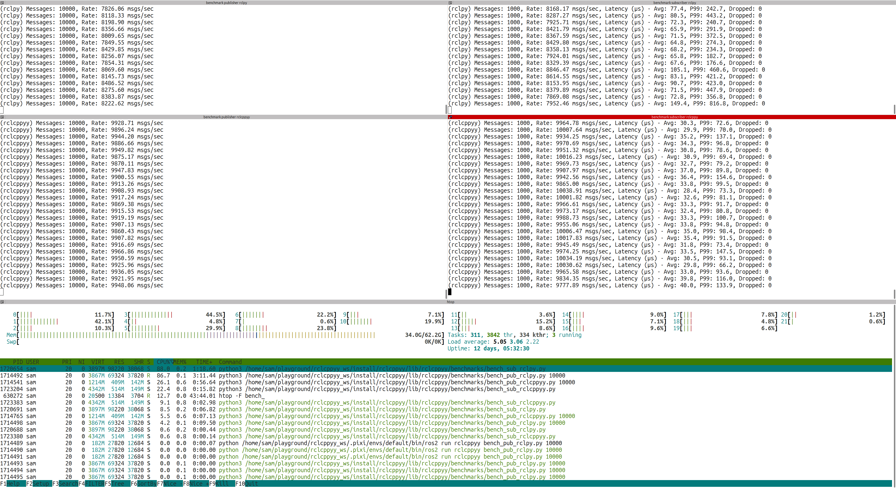

# rclcppyy

ROS 2 package providing `rclcpp` bindings via [cppyy](https://cppyy.readthedocs.io/en/latest/) and examples on how to use `cppyy` in ROS2.

* Tired of writing python wrappers for your C++ code?
* Missing features from C++ APIs that you'd like to call in Python?
* Do you like to prototype and test in Python but you use a lot of C++ code?

`cppyy` can help you! Cppyy is a Python-C++ bindings library that provides automatic, runtime-based access to C++ code from Python using reflection and just-in-time compilation. It enables seamless interoperability between the two languages, allowing Python to call C++ functions and manipulate C++ objects directly.

This repository aims to expose useful ROS2 C++ (and related) APIs via automatic wrapping with `cppyy`.

For example you will be able to:
* Transparently use `rclcpp`'s
    * Node
    * Publisher
    * Subscriber
    * Timer
    * Messages (without converting Python<>C++, always working on the C++ representation!)
    * init/spin/shutdown
    * Loaned messages (TODO!)

To automatically replace your `rclpy` with `rclcpp` classes/methods just place at the top of your Python file:
```python
import rclcppyy; rclcppyy.enable_cpp_acceleration()
# Rest of your code doing import rclpy, from sensor_msgs.msg import Image... etc
```

To get an idea of how working with `cppyy` (without the quality of life features of `rclcppyy`) the code looks like (excerpt from an example):
```python
import cppyy
# include/import your stuff and then...

if not cppyy.gbl.rclcpp.ok():
    cppyy.gbl.rclcpp.init(len(sys.argv), sys.argv)

    # Some code in a class...
    self.node = cppyy.gbl.rclcpp.Node("node_exmaple")
    self.publisher = self.node.create_publisher[cppyy.gbl.std_msgs.msg.String](
        "pub_topic", 10)
        
    # Define the callback wrapper with proper Python.h include
    cppyy.cppdef("""
        #include <Python.h>
        #include <functional>
        
        static std::function<void()> create_timer_callback(PyObject* self) {
            return [self]() {
                if (self && PyObject_HasAttrString(self, "timer_callback")) {
                    PyObject_CallMethod(self, "timer_callback", nullptr);
                }
            };
        }
    """)

    callback = cppyy.gbl.create_timer_callback(self)
    self.timer = self.node.create_wall_timer(
        cppyy.gbl.std.chrono.nanoseconds(10000),
        callback)

    self.start_time = cppyy.gbl.std.chrono.steady_clock.now()
```

## Examples

* Benchmarks (ran on a Intel® Core™ Ultra 7 165H × 22 on "Performance" mode on Ubuntu 24.04)
    * Running a publisher and a subscriber (small `std_msgs/String`) at **1khz**
    
        * `rclpy` uses 15~% CPU for the publisher, and 18~% CPU for the subscriber
        * `rclcppyy` uses 4~% CPU for the publisher, and 4~% CPU for the subscriber

    * Running a publisher and a subscriber (small `std_msgs/String`) at **10khz**
    
        * `rclpy` uses 86~% CPU for the publisher, and 88~% CPU for the subscriber
        * `rclcppyy` uses 26~% CPU for the publisher, and 22~% CPU for the subscriber

* The `publisher_member_function.py` [Writing a simple publisher and subscriber (Python)](https://docs.ros.org/en/jazzy/Tutorials/Beginner-Client-Libraries/Writing-A-Simple-Py-Publisher-And-Subscriber.html) tutorial using `rclcppyy` as backend. [scripts/ros_tutorials/publisher_member_function.py](scripts/ros_tutorials/publisher_member_function.py).
* Note that the `rclpy` publisher benchmark [bench_pub_rclpy.py](scripts/benchmarks/bench_pub_rclpy.py) can be switched to the `rclcppyy` backend by uncommenting the `enable_cpp_acceleration` line at the top.


## Run demos
Easiest way to test by yourself is using a Pixi workspace. TODO: make a repo with the Pixi workspace ready to use, with this repo as a git submodule.

For now one can take this `pixi.toml`:
```toml
[workspace]
authors = ["Sam Pfeiffer <sammypfeiffer@gmail.com>"]
channels = ["conda-forge", "robostack-jazzy"]
name = "rclcppyy_ws"
platforms = ["linux-64"]
version = "0.1.0"

[tasks]

[dependencies]
ros-jazzy-ros-base = ">=0.11.0,<0.12"
opencv = ">=4.11.0,<5"

[activation]
scripts = ["fix_cppyy_api_path.sh"]
# To silence warning: non-portable path to file '"cpycppyy/API.h"'; specified path differs in case from file name on disk [-Wnonportable-include-path]
# From patching the wrong path due to capitalisation from the current cppyy packaged version
env = { EXTRA_CLING_ARGS = "-Wno-nonportable-include-path" }

[pypi-dependencies]
cppyy = ">=3.5.0, <4"
```

And do:
```bash
# If you haven't installed pixi:
curl -fsSL https://pixi.sh/install.sh | sh
source ~/.bashrc

# Clone this repo
mkdir -p rclcppyy_ws/src
cd rclcppyy_ws/src
git clone https://github.com/awesomebytes/rclcppyy
cd ..
# Copy the `pixi.toml` here and
pixi install
pixi shell
# You'll be in a shell with the environment fully ready after a few seconds
```


### Build

Once in the pixi workspace or in a system with all dependencies...

```bash
cd /path/to/workspace
colcon build --packages-select rclcppyy
source install/setup.bash
```

### Run

```bash
# One on each shell probably
ros2 run rclcppyy bench_pub_rclpy.py 10000
ros2 run rclcppyy bench_sub_rclpy.py

ros2 run rclcppyy bench_pub_rclcppyy.py 10000
ros2 run rclcppyy bench_sub_rclcppyy.py

# Or the tutorial example
ros2 run rclcppyy publisher_member_function.py
```

## Roadmap

[x] Benchmark pub/sub

[x] Get rclpy tutorials code to run with rclcppyy backend.

[x] Monkeypatch/substitute rclpy with rclcppyy and make your Python nodes use less CPU!

[x] Monkeypatch/substitute rclpy messages for rclcpp messages (so to avoid conversions).

[ ] (WIP) Generate stubs to get IDE autocompletion.

[ ] (WIP) Demo images (these big images ones should be done with loaned or zero-cost copy messages).

[ ] Demo use python testing packages with C++.

[ ] Demo use python CLI generator with C++.

[ ] Demo use C++ Markers classes from Python.

[ ] Demo use zero-copy torch.

[ ] Demo use C++ rosbag reader (to C++ messages).

[ ] Demo pointclouds.

[ ] Demo Nav2.

[ ] Demo Moveit2.

[ ] Demo ROS control.

[ ] Separate into different packages the base `rclcppyy` and other demos/reusable pieces.


## TODO

* Bring down the bringup of rclcppyy time (currently 2.5s~) by figuring out how to build a `.pcm` + `.so` dictionary that is pre-compiled (or at least compiled just once per machine)