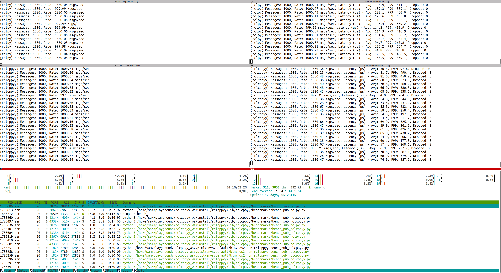
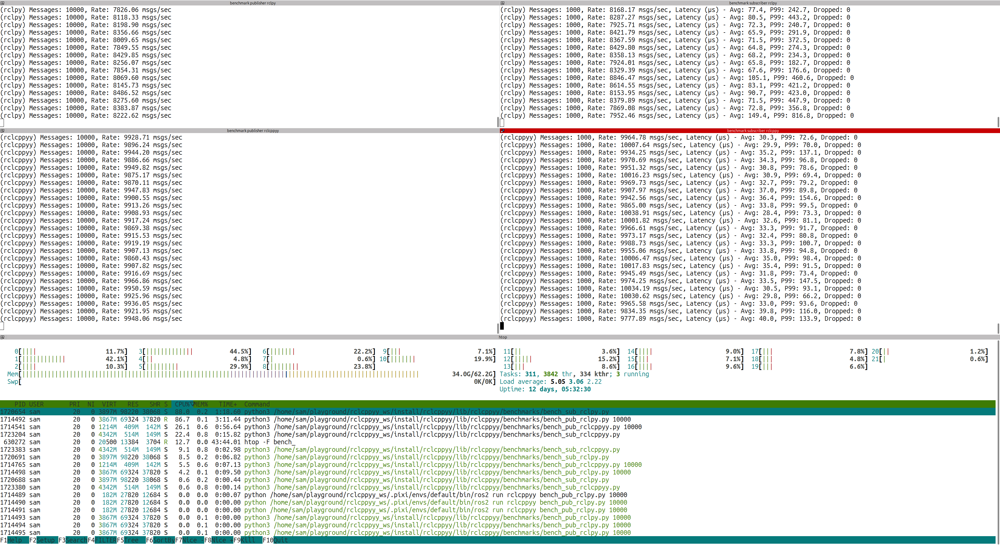

# rclcppyy

[](https://github.com/awesomebytes/rclcppyy/actions/workflows/ci.yml)

ROS 2 package providing `rclcpp` bindings via [cppyy](https://cppyy.readthedocs.io/en/latest/) and examples on how to use `cppyy` in ROS2.


* Tired of writing python wrappers for your C++ code?
* Missing features from C++ APIs that you'd like to call in Python?
* Do you like to prototype and test in Python but you use a lot of C++ code?

`cppyy` can help you! Cppyy is a Python-C++ bindings library that provides automatic, runtime-based access to C++ code from Python using reflection and just-in-time compilation. It enables seamless interoperability between the two languages, allowing Python to call C++ functions and manipulate C++ objects directly.

This repository aims to expose useful ROS2 C++ (and related) APIs via automatic wrapping with `cppyy`.

For example you will be able to:
* Transparently use `rclcpp`'s
    * Node
    * Publisher
    * Subscriber
    * Timer
    * Messages (without converting Python<>C++, always working on the C++ representation!)
    * init/spin/shutdown
    * Loaned messages (TODO!)

To automatically replace your `rclpy` with `rclcpp` classes/methods just place at the top of your Python file:
```python
import rclcppyy; rclcppyy.enable_cpp_acceleration()
# Rest of your code doing import rclpy, from sensor_msgs.msg import Image... etc
```

To get an idea of how working with `cppyy` (without the quality of life features of `rclcppyy`) the code looks like (excerpt from an example):
```python
import cppyy
# include/import your stuff and then...

if not cppyy.gbl.rclcpp.ok():
    cppyy.gbl.rclcpp.init(len(sys.argv), sys.argv)

    # Some code in a class...
    self.node = cppyy.gbl.rclcpp.Node("node_exmaple")
    self.publisher = self.node.create_publisher[cppyy.gbl.std_msgs.msg.String](
        "pub_topic", 10)
        
    # Define the callback wrapper with proper Python.h include
    cppyy.cppdef("""
        #include <Python.h>
        #include <functional>
        
        static std::function<void()> create_timer_callback(PyObject* self) {
            return [self]() {
                if (self && PyObject_HasAttrString(self, "timer_callback")) {
                    PyObject_CallMethod(self, "timer_callback", nullptr);
                }
            };
        }
    """)

    callback = cppyy.gbl.create_timer_callback(self)
    self.timer = self.node.create_wall_timer(
        cppyy.gbl.std.chrono.nanoseconds(10000),
        callback)

    self.start_time = cppyy.gbl.std.chrono.steady_clock.now()
```

## Examples

* Benchmarks (ran on a Intel® Core™ Ultra 7 165H × 22 on "Performance" mode on Ubuntu 24.04)
    * Running a publisher and a subscriber (small `std_msgs/String`) at **1khz**
    
        * `rclpy` uses 15~% CPU for the publisher, and 18~% CPU for the subscriber
        * `rclcppyy` uses 4~% CPU for the publisher, and 4~% CPU for the subscriber

    * Running a publisher and a subscriber (small `std_msgs/String`) at **10khz**
    
        * `rclpy` uses 86~% CPU for the publisher, and 88~% CPU for the subscriber
        * `rclcppyy` uses 26~% CPU for the publisher, and 22~% CPU for the subscriber

* The `publisher_member_function.py` [Writing a simple publisher and subscriber (Python)](https://docs.ros.org/en/jazzy/Tutorials/Beginner-Client-Libraries/Writing-A-Simple-Py-Publisher-And-Subscriber.html) tutorial using `rclcppyy` as backend. [scripts/ros_tutorials/publisher_member_function.py](scripts/ros_tutorials/publisher_member_function.py).
* Note that the `rclpy` publisher benchmark [bench_pub_rclpy.py](scripts/benchmarks/bench_pub_rclpy.py) can be switched to the `rclcppyy` backend by uncommenting the `enable_cpp_acceleration` line at the top.


## Install (pixi, no build needed)

If you just want to *use* `rclcppyy` (no clone, no `colcon build`), add the
prefix.dev channel and the package to your own pixi workspace:

```toml
channels = ["https://repo.prefix.dev/awesomebytes", "robostack-jazzy", "conda-forge"]

[dependencies]
ros-jazzy-rclcppyy = "*"
```

Then `import rclcppyy; rclcppyy.enable_cpp_acceleration()` works out of the box —
no `LD_LIBRARY_PATH` or activation setup required. Message packages you publish
or subscribe (e.g. `ros-jazzy-std-msgs`) are separate dependencies, as in any
ROS 2 project.

## Kits

Beyond `rclcpp` itself, this repo uses the same `cppyy` approach to drive other
C++ robotics libraries from Python: a "kit" is a thin layer that mirrors the
library's own API and hides only the `cppyy` friction (bringup, lifetime,
crossing callbacks, teardown), rather than inventing a new one. Six kits exist
today — [BehaviorTree.CPP](https://www.behaviortree.dev/) (no other Python binding
of it exists), [PCL](https://pointclouds.org/), [OMPL](https://ompl.kavrakilab.org/),
[Nav2](https://docs.nav2.org/), [MoveIt 2](https://moveit.ai/), and
[ros2_control](https://control.ros.org/) — plus a vision loop-closure **tutorial**
composing OpenCV + DBoW2 + GTSAM. The patterns common to all live in
[`rclcppyy/kits/cppyy_kit.py`](rclcppyy/kits/cppyy_kit.py).

Measured results:

| Kit | What it shows | Number |
|---|---|---|
| BT.CPP | official tutorials in Python, XML verbatim | 16–24 lines; ~630k ticks/s (Python leaves) |
| PCL | NumPy→VoxelGrid→NumPy pipeline vs rclpy+NumPy (100k pts @ 10 Hz) | 14.8× lower latency, 9.4× less CPU, same LOC |
| OMPL | Python subclass called by RRT\* in its hot loop (cross-inheritance) | 1M+ calls/solve, ~350 ns/call; Python validity ~159× native (lowerable to C++) |
| Nav2 | your own nav stack — Costmap2D + NavFn from Python, no lifecycle servers | NavFn plan ~80× a Python A\* |
| MoveIt 2 | full MoveIt C++ API (FK, FCL, real OMPL plan) + collision-aware IK | validity-callback IK that moveit_py cannot express |
| ros2_control | a Python controller running inside the real `controller_manager` | 100 Hz update loop, solid |
| vision tutorial | zero-copy ROS `Image`→`cv::Mat` ingest, DBoW2 loop closure, GTSAM back-end | ingest ~155× @1080p; GTSAM ~15× drift fix; optional CUDA ORB ~5.3× |
| L1 "freeze" (Cling PCH) | header parse eliminated | 890 ms → 6 ms (~140×); rclcpp 1.71 s → 6 ms |
| L2 lowering | Python leaf → native `.so` | ~2.8× tick rate, identical output |

Quick run (each kit has its own opt-in pixi env):

```bash
pixi run -e bt demo-bt-t01           # + demo-bt-t03 (mixed Python/C++/ROS tree)
pixi run -e pcl bench-pcl
pixi run -e ompl demo-ompl-plan
pixi run -e nav2 demo-nav2-stack
pixi run -e moveit demo-moveit-plan
pixi run -e control demo-control-python
pixi run -e vision demo-vision-loop
```

More detail: [docs/kits/COMMON_PATTERNS.md](docs/kits/COMMON_PATTERNS.md) and
[docs/kits/FREEZE.md](docs/kits/FREEZE.md); the vision walkthrough in
[docs/tutorials/vision_loop_closure.md](docs/tutorials/vision_loop_closure.md);
per-kit "why" docs [bt](docs/bt_kit/WHY.md), [pcl](docs/pcl_kit/WHY.md),
[ompl](docs/ompl_kit/WHY.md), [nav2](docs/nav2_kit/WHY.md),
[moveit](docs/moveit_kit/WHY.md), [control](docs/control_kit/WHY.md).

## Setup

The workspace is a self-contained [pixi](https://pixi.sh) project: the manifest
(`pixi.toml`) and lockfile (`pixi.lock`) live in this repo, so `pixi install`
reproduces the exact environment (ROS 2 Jazzy from robostack, `cppyy` from
conda-forge, compilers, colcon). No manual steps, no workarounds.

```bash
# If you haven't installed pixi:
curl -fsSL https://pixi.sh/install.sh | sh
source ~/.bashrc

git clone https://github.com/awesomebytes/rclcppyy
cd rclcppyy
pixi install        # downloads the environment (a few GB the first time)
pixi run build      # colcon build --packages-select rclcppyy
```

`pixi run build` builds the package into `install/`. To get an interactive shell
with the environment (and the built workspace) already activated:

```bash
pixi shell
```

Inside `pixi shell` the workspace overlay is sourced automatically and the
recommended middleware defaults are already set (`RMW_IMPLEMENTATION=rmw_cyclonedds_cpp`,
`ROS_AUTOMATIC_DISCOVERY_RANGE=LOCALHOST`) — the ROS default fastrtps has random
latency issues and big messages don't pass through, so cyclonedds on LOCALHOST is
the default here.

Tasks: `pixi run build`, `pixi run test` (runs pytest on `test/`), `pixi run clean`
(removes `build/ install/ log/`).

### Run

Everything runs in a single command from a clean checkout — no juggling four
shells and watching `top`:

```bash
pixi run bench           # rclpy vs rclcppyy CPU comparison table (1 kHz + 10 kHz)
pixi run demo-tutorial   # the rclpy pub/sub tutorial, on the rclcppyy C++ backend
pixi run demo-pubsub     # a live pub/sub pair (rclcppyy backend), stats streamed
```

`pixi run bench` spawns each publisher/subscriber pair as separate child
processes, warms up (the rclcppyy variants JIT-compile `rclcpp` on first
bringup, ~2 s, excluded from the measurement), samples each process's CPU with
`psutil` while parsing the subscriber's throughput/latency, kills the children
itself, and prints a table per rate:

```
  Benchmark @ 1000 Hz target
  =======================================================================================
  variant                   pub CPU%  sub CPU%  msgs recv  eff Hz    dropped  avg lat us
  ---------------------------------------------------------------------------------------
  rclpy                     18.1      20.6      15000      995.4     0        227.9
  rclcppyy (monkeypatched)  3.8       4.8       15000      967.7     0        130.1
```

Flags pass straight through the pixi task:

```bash
pixi run bench --rate 5000 --duration 10                       # custom rate / window
pixi run bench --variants rclpy,rclcppyy,rclcppyy-templated    # add the pure-cppyy pair
pixi run bench --json                                          # machine-readable output
```

<details>
<summary>Advanced: run the individual bench scripts by hand</summary>

Enter the environment with `pixi shell` (middleware defaults and the workspace
overlay are applied automatically), then, one per shell:

```bash
# rclpy baseline
ros2 run rclcppyy bench_pub_rclpy.py 10000
ros2 run rclcppyy bench_sub_rclpy.py

# rclcppyy (monkeypatched rclpy → C++ backend)
ros2 run rclcppyy bench_pub_rclcppyy_monkeypatch.py 10000
ros2 run rclcppyy bench_sub_rclcppyy_monkeypatched.py

# Monitor with
# top -c -p $(pgrep -d, -f bench_)

# Or the tutorial example
ros2 run rclcppyy publisher_member_function.py
```

Without entering a shell, any command can be run through pixi directly, e.g.
`pixi run ros2 run rclcppyy bench_sub_rclcppyy_monkeypatched.py`.
</details>

### Extra demos (optional env)

The heavier example scripts (OpenCV, PCL, GStreamer, typer, hypothesis) live in
an optional `demos` environment so the default `pixi install` stays lean. Enable
it once, then run any demo task with `pixi run -e demos <task>`:

```bash
pixi install -e demos       # adds opencv, pcl, pcl_conversions, eigen,
                            # gstreamer, pygobject, typer, hypothesis
```

| Task | What it does |
|---|---|
| `pixi run -e demos demo-images` | Publishes a real JPEG as a `sensor_msgs/Image` at 4 Hz through the rclcppyy C++ backend (builds the message straight into a C++ `std::vector`, no Python<>C++ copy). Pair it with `pixi run -e demos python scripts/big_messages_demos/images_sub.py` to see it received. |
| `pixi run -e demos demo-hypothesis` | Drives a JIT-compiled C++ function with [Hypothesis](https://hypothesis.readthedocs.io) property-based testing. Intentionally finds the failing input (`"DDS"`) and reports it as a falsifying example, so it exits non-zero on purpose — that's the demo. |
| `pixi run -e demos demo-pointcloud-voxelgrid` | JIT-compiles a PCL `VoxelGrid` filter (via `pcl_conversions`) and runs it as a ROS 2 node. The JIT/compile step runs on startup; it then waits for `PointCloud2` messages on `/lexus3/os_center/points`, so it needs an external bag to actually downsample anything (see below). |

`roscon_uk_2025/` is the archive of the ROSCon UK 2025 presentation. Some of its
demos need external data that is not in this repo and therefore have no `pixi
run` task:

- `1_pointcloud_passthrough.py` / `2_pointcloud_voxelgrid.py` — need a live
  `PointCloud2` source (the talk used a bag published on
  `/lexus3/os_center/points`; `0_setup_pointcloud.sh` shows the `ros2 bag play`
  + RViz setup).
- `3_cloudini_cli.py` — a typer CLI over the C++
  [cloudini](https://github.com/facontidavide/cloudini) point-cloud compressor;
  needs a cloudini colcon workspace checked out and built alongside it (it
  auto-discovers the workspace root and loads the built `.so`).
- `4_gstreamer_cli.py` — a typer CLI that JIT-compiles a C++ pixel kernel and
  runs it inside a GStreamer pipeline; needs a V4L2 camera at `/dev/video0` (and
  a display for the default `--viz` output).

## Roadmap

[x] Benchmark pub/sub

[x] Get rclpy tutorials code to run with rclcppyy backend.

[x] Monkeypatch/substitute rclpy with rclcppyy and make your Python nodes use less CPU!

[x] Monkeypatch/substitute rclpy messages for rclcpp messages (so to avoid conversions).

[ ] (WIP) Generate stubs to get IDE autocompletion.

[ ] (WIP) Demo images (these big images ones should be done with loaned or zero-cost copy messages).

[x] Demo use python testing packages with C++.

[x] Demo use python CLI generator with C++.

[ ] Demo use C++ Markers classes from Python.

[ ] Demo use zero-copy torch.

[x] (WIP) Demo use C++ rosbag reader (to C++ messages).

[x] Demo pointclouds.

[ ] Demo Nav2.

[ ] Demo Moveit2.

[ ] Demo ROS control.

[ ] Separate into different packages the base `rclcppyy` and other demos/reusable pieces.


## TODO

* Bring down the bringup of rclcppyy time (currently 2.5s~) by figuring out how to build a `.pcm` + `.so` dictionary that is pre-compiled (or at least compiled just once per machine)