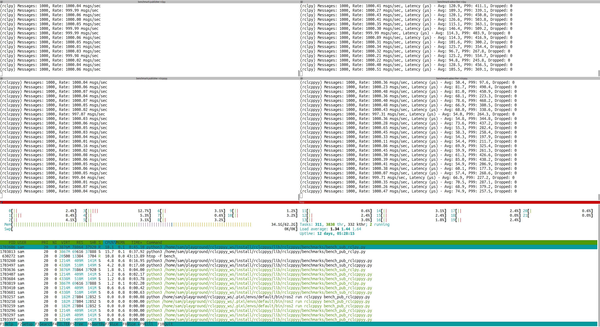

# rclcppyy

ROS 2 package providing rclcpp bindings via cppyy and examples on how to use cppyy in ROS2.

* Tired of writing python wrappers for your C++ code?
* Missing features from C++ APIs that you'd like to call in Python?
* Do you like to prototype and test in Python but you use a lot of C++ code?

`cppyy` can help you! Cppyy is a Python-C++ bindings library that provides automatic, runtime-based access to C++ code from Python using reflection and just-in-time compilation. It enables seamless interoperability between the two languages, allowing Python to call C++ functions and manipulate C++ objects directly.

This repository aims to expose useful ROS2 C++ (and related) APIs via automatic wrapping with `cppyy`.

For example you will be able to:
* Transparently use `rclcpp`'s
    * Node
    * Publisher
    * Subscriber (WIP, not monkeypatched yet, just manual example in [bench_sub_rclcppyy.py)](scripts/benchmarks/bench_sub_rclcppyy.py))
    * Timer
    * Messages (without converting Python<>C++, always working on the C++ representation)
    * Loaned messages (TODO!)

Replace your `rclpy` with `rclcpp` ones just by placing at the top of your Python file:
```python
import rclcppyy; rclcppyy.enable_cpp_acceleration()
```

And overall, to work with `cppyy` the code looks like (excerpt from an example):
```python
import cppyy
# include/import your stuff and then...

if not cppyy.gbl.rclcpp.ok():
    cppyy.gbl.rclcpp.init(len(sys.argv), sys.argv)
    
self.node = cppyy.gbl.rclcpp.Node("node_exmaple")
self.publisher = self.node.create_publisher[cppyy.gbl.std_msgs.msg.String](
    "pub_topic", 10)
    
# Define the callback wrapper with proper Python.h include
cppyy.cppdef("""
    #include <Python.h>
    #include <functional>
    
    static std::function<void()> create_timer_callback(PyObject* self) {
        return [self]() {
            if (self && PyObject_HasAttrString(self, "timer_callback")) {
                PyObject_CallMethod(self, "timer_callback", nullptr);
            }
        };
    }
""")

callback = cppyy.gbl.create_timer_callback(self)
self.timer = self.node.create_wall_timer(
    cppyy.gbl.std.chrono.nanoseconds(10000),
    callback)

self.start_time = cppyy.gbl.std.chrono.steady_clock.now()
```

## Examples

* Benchmarks (ran on a Intel® Core™ Ultra 7 165H × 22 on "Performance" mode on Ubuntu 24.04)
    * Running a publisher and a subscriber at 1khz
    
        * rclpy uses 15~% CPU for the publisher, and 18~% CPU for the subscriber
        * rclccpyy uses 4~% CPU for the publisher, and 4~% CPU for the subscriber

    * Running a publisher and a subscriber at 10khz
    
        * rclpy uses 86~% CPU for the publisher, and 88~% CPU for the subscriber
        * rclccpyy uses 26~% CPU for the publisher, and 22~% CPU for the subscriber

* The `publisher_member_function.py` [Writing a simple publisher and subscriber (Python)](https://docs.ros.org/en/jazzy/Tutorials/Beginner-Client-Libraries/Writing-A-Simple-Py-Publisher-And-Subscriber.html) tutorial using `rclcppyy` as backend. [scripts/ros_tutorials/publisher_member_function.py](scripts/ros_tutorials/publisher_member_function.py).


## Run demos
Easiest way to test by yourself is using a Pixi workspace. TODO: make a repo with the Pixi workspace ready to use, with this repo as a git submodule.

### Build

Once in the pixi workspace or in a system with all dependencies...

```bash
cd /path/to/workspace
colcon build --packages-select rclcppyy
source install/setup.bash
```

### Run

```bash
# One on each shell probably
ros2 run rclcppyy bench_pub_rclpy.py 10000
ros2 run rclcppyy bench_sub_rclpy.py

ros2 run rclcppyy bench_pub_rclcppyy.py 10000
ros2 run rclcppyy bench_sub_rclcppyy.py

# Or the tutorial example
ros2 run rclcppyy publisher_member_function.py
```

## Roadmap

[x] Benchmark pub/sub

[x] (WIP) Get rclpy tutorials code to run with rclcppyy backend (Got the publisher one!).

[ ] (WIP) Monkeypatch/substitute rclpy with rclcppyy and make your Python nodes use less CPU!

[x] Monkeypatch/substitute rclpy messages for rclcpp messages (so to avoid conversions).

[ ] (WIP) Generate stubs to get IDE autocompletion.

[ ] (WIP) Demo images (these big images ones should be done with loaned or zero-cost copy messages).

[ ] Demo pointclouds.

[ ] Demo Nav2.

[ ] Demo Moveit2.

[ ] Demo ROS control.

[ ] Separate into different packages the base `rclcppyy` and other demos/reusable pieces.


## TODO

* Bring down the bringup of rclcppyy time (currently 2.5s~) by figuring out how to build a `.pcm` + `.so` dictionary that is pre-compiled (or at least compiled just once per machine)