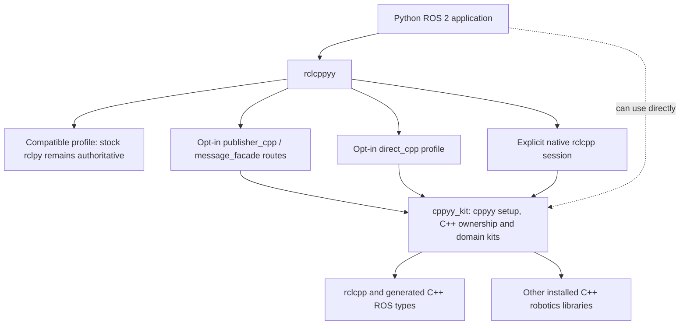

# rclcppyy and cppyy_kit: a user overview

## What the projects offer

**rclcppyy** lets a ROS 2 Python application keep using the `rclpy` API while
opting selected work into real C++ `rclcpp` entities and generated C++ message
values. Its compatible mode leaves `rclpy` in charge. The explicit `direct_cpp`
profile is an experimental, bounded route for applications that can accept its
Jazzy-specific interface and executor limits.

**cppyy_kit** is a suite of tools for calling installed C++ libraries from Python.
Its ROS-free `cppyy-kit` base package handles cppyy setup, lifetimes, and small
inline C++ kernels; `rclcpp_kit` supplies the ROS C++ layer used by `rclcppyy`.
Other domain kits cover robotics libraries such as
`rclcpp`, BehaviorTree.CPP, PCL, and OMPL. Use it directly when you want Python to
orchestrate a C++ library or want to move a measured hot kernel into C++ without
writing a separate binding layer.
The suite caches compiled wrappers and kernels; `@cpp(nogil=True)` can release the
Python GIL while a pure C++ kernel runs. Calling back into Python still requires
the GIL, and the target library's headers and binaries must be installed.



## Choose a path

| If you want to… | Start with… |
|---|---|
| Keep an existing `rclpy` application behaving as it does now | `enable_cpp_acceleration()` with the compatible profile (the default) |
| Test same-handle C++ publishing or C++-owned `String`/`UInt64` messages | `profile="publisher_cpp"` or `profile="message_facade"`; inspect `rclcppyy.status()` and benchmark your workload |
| Require the supported publisher route to use C++ rather than silently fall back | `profile="required_cpp"`; other entity types still fail closed |
| Keep stock entities while using bounded executor waits for shutdown reliability | `profile="optimized"`; this is a reliability option, not a C++ speedup claim |
| Use actual C++ message values and `rclcpp` entities behind familiar `rclpy` calls | `profile="direct_cpp"`; read the limits below first |
| Write an application directly against C++ robotics libraries | `rclcppyy.native(...)` or the relevant `cppyy_kit` domain kit |
| Compile a small numerical or control kernel from Python | `cppyy_kit`'s `@cpp` interface |

A minimal compatible start is:

```python
import rclcppyy
rclcppyy.enable_cpp_acceleration()

import rclpy
from std_msgs.msg import String

rclpy.init()
node = rclpy.create_node("talker")
publisher = node.create_publisher(String, "chatter", 10)
publisher.publish(String(data="hello"))
```

This example intentionally selects the compatible profile; it does not claim the
publish call runs in C++. See the [backend selection guide](backend-selection.md)
for profile behavior and evidence.

For `direct_cpp`, activate before importing `rclpy.node`, `rclpy.executors`, or
supported generated interfaces. A small example is:

```python
import rclcppyy
rclcppyy.enable_cpp_acceleration(profile="direct_cpp")

import rclpy
from rclpy.node import Node
from std_msgs.msg import String

class Talker(Node):
    def __init__(self):
        super().__init__("talker")
        self.publisher = self.create_publisher(String, "chatter", 10)
        self.timer = self.create_timer(
            0.5, lambda: self.publisher.publish(String(data="hello")))

rclpy.init()
node = Talker()
rclpy.spin(node)
node.destroy_node()
rclpy.shutdown()
```

The default direct interface registry includes `std_msgs/msg/String`,
`std_msgs/msg/UInt64`, `std_srvs/srv/SetBool`, and the
`tf2_msgs/action/LookupTransform` client. Additional installed message, service,
and action types can be registered by canonical ROS interface name at activation.

## Verified direct C++ surface and its limits

The current source has live Jazzy/Cyclone coverage for direct nodes, C++ pub/sub,
timers, graph queries, local parameters, services, action clients, and a bounded
ActionServer slice. The public direct executors include both
`SingleThreadedExecutor` (STE) and `MultiThreadedExecutor` (MTE). MTE supports real
concurrent dispatch: tests check overlap with reentrant groups, serialization with
mutually-exclusive groups, exception containment, and teardown during dispatch.
Callback groups are native and support the default, mutually-exclusive, and
reentrant forms for supported entities.
On x86-64 Jazzy/Cyclone, full CI passed on this branch's tested code with suite
`0cdc18e` (844 passed, 14 skipped, 3 xfailed). The production compiled callback
bridge covers ordinary typed `DirectNode` subscriptions and services; option-bearing
and raw subscriptions; timers; supported publisher/subscription QoS events; and
pre/on/post parameter callbacks through a separate compiled bridge.

Exact-source ARM64 product CI passed on this branch's tested code and suite `0cdc18e`
(830 passed, 28 skipped, 3 xfailed). This includes the remote
`AsyncParameterClient` parameter callback test under MTE. Focused checks also
passed for local parameter callback teardown with the MTE live and the parameter
set from an external Python thread (1 test), timer/service self-destruction (50
helper iterations each), and QoS deadline-event teardown (50 helper iterations).
Fresh-process ARM repetitions then passed 5/5 for timer/service self-destruction
(50 helper iterations per process) and 5/5 for QoS deadline-event teardown
(50 iterations per process). These cohorts cover the exercised routes and do not
establish universal MTE safety.
The full `cppyy_kit` `rclcpp_kit/tests` suite also passed at suite `0cdc18e` on
this branch's tested code: 265/265 tests in 1619.62 s. Its first attempt was invalid
because `AMENT_PREFIX_PATH` was unset; the corrected run preserved the Pixi ROS
environment. Log/XML: `arm64-artifacts/arm64-evidence/parameter-slice-c49daa4-0cdc18e/full-rclcpp-kit-arm-correct-env.log` and `.xml`.
The suite recipe used the existing ARM `rattler-build` environment because its
Pixi task is linux-64-only.

The ARM cppyy package was built locally as
`cppyy-3.5.0-py312h7e7ac48_2.conda` and passed a local file-channel Pixi proof for
import and `cppdef` evaluation (`20 + 22 == 42`). This followed an initial lock and
channel gap for a top-level ARM `cppyy` Conda package. The artifact has not been
uploaded.

An earlier ARM64 run on 2026-09-26, before this compiled bridge work, passed
dispatch, wake/teardown, and true-parallelism checks, then hit SIGSEGV during
timer/service self-destruction after all 50 timer iterations. Its stack entered
Cling reflection and metadata code while executor workers were active; the cause
remains unclassified. That run is historical evidence and does not characterize
the current bridge. MTE remains experimental; use the direct single-threaded
executor where a proven direct executor is required.

The service client offers both `call_async()` and blocking `call()`. Blocking calls
need another thread to spin the servicing executor; calling synchronously from a
callback serviced by that same executor can deadlock, as with `rclpy`.

The direct `ActionServer` is deliberately narrower: synchronous callbacks, default
QoS, and a mutually-exclusive group. It supports goal acceptance/rejection,
feedback, results, and cancellation, including interoperation with an unchanged
stock `rclpy` action client. Construct it before attaching its node to an MTE;
goal and cancel decisions run on the server's creator thread. That limited MTE
setup is covered by a test, while normal action-server dispatch uses the
single-threaded executor. Reentrant server execution, coroutine callbacks, custom
action QoS, and introspection are unsupported.

This is not full `rclpy` parity. Unsupported direct operations should fail closed;
use the compatible profile when the application needs the broader stock surface.
Activation is process-global and must happen before the guarded imports. Read the
[compatibility manifest](../compatibility/jazzy.json) and the detailed
[backend guide](backend-selection.md) for API-by-API limits.

No general speedup is promised. A C++ route changes where work runs; whether that
helps depends on message size, callback work, executor, middleware, and machine.
Measure the application on its target system. Current benchmark results are
characterizations and do not promote a general performance claim.

## Published releases and source development

The user-facing README documents the published `rclcppyy` **0.2.0** package. The
development source tree declares `rclcppyy` **0.3.0** and its package recipe
targets `cppyy_kit` **0.2.0**. Recent local x86-64 and ARM64 package proofs
validate candidate build/install paths; those artifacts are local evidence, not
published packages. For a released installation, follow the [README install
instructions](../README.md#install-pixi--conda--no-build-needed). For source
development, use the repository's `pixi` tasks and the pinned suite source
described by [`suite-source.lock.json`](../suite-source.lock.json).
For a new `cppyy_kit` project, start with the suite's
[installation guide](https://github.com/awesomebytes/cppyy_kit#install) and install
only the kits for the C++ libraries you use. The verified local package builds and
ARM64 bridge proof use Python 3.12.

## Where to go next

- [README](../README.md): installation, examples, profiles, and benchmark entry points.
- [Backend selection](backend-selection.md): which execution route fits an application.
- [Jazzy compatibility manifest](../compatibility/jazzy.json): tested API slices and
  known boundaries.
- [cppyy_kit README](https://github.com/awesomebytes/cppyy_kit): C++ access, domain kits, and inline kernels.
