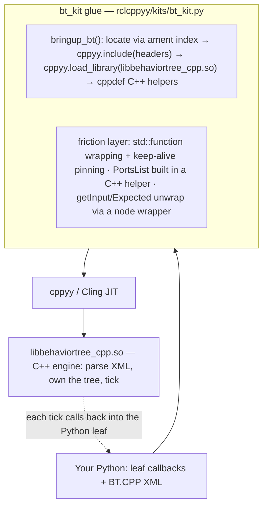

# bt_kit spike — driving BehaviorTree.CPP v4 from Python via cppyy

**Date:** 2026-07-10 · **Env:** pixi `bt` (robostack-jazzy + conda-forge),
`ros-jazzy-behaviortree-cpp 4.9.0`, `cppyy 3.5.0`, Python 3.12.13, linux-64.
**Question:** can the official BehaviorTree.CPP tutorials be written in Python and
executed by the C++ tree engine, with minimal glue and no official binding (none
exists — py_trees is a separate, incompatible library)?

**Verdict: YES, with bounded caveats. GO** for continuing to invest in the kit
strategy, provided the kit hides cppyy from the user (several raw cppyy operations
segfault the process). The v0 API deliberately **mirrors the C++ API** — see §2.

(For the motivation and a C++-vs-Python side-by-side, see [WHY.md](WHY.md); for the
API, see [BT.CPP_KIT.md](BT.CPP_KIT.md).)

---

## How the kit works



Bringup locates the install, JIT-includes the headers, and loads the `.so` so
calls resolve; the friction layer wraps Python callables as `std::function`s
(pinned alive), builds the port list in a C++ helper (Python construction
segfaults — see §1), and unwraps `getInput`/`Expected<T>` behind a small node
object. The engine parses the XML and ticks; each tick calls back into the
Python leaf.

**The same recipe generalizes.** Every future kit (`pcl_kit`, `ompl_kit`,
`ceres_kit`, …) is the same three ingredients: **(1) bringup** — locate the
install (ament index or known prefix), `cppyy.include` its headers,
`cppyy.load_library` its `.so`; **(2) hide the sharp edges** cppyy has for that
library — build STL containers in `cppdef` C++ helpers, keep ownership-crossing
lambdas in C++, pin callables, unwrap awkward return types; **(3) mirror the
library's own API** so a user's (or an LLM's) existing knowledge of that library
transfers 1:1. bt_kit is the worked example — ~180 lines of Python plus a
~40-line C++ helper.

---

## 1. Possible at all? — capability probe matrix

Each capability was probed in isolation from the `bt` env against the installed
4.9.0 headers/library.

| # | Capability | Possible? | How / why |
|---|---|:--:|---|
| 1 | Basic tree: built-in nodes, `createTreeFromText`, `tickWhileRunning` | **YES** | `BT::BehaviorTreeFactory` constructs, parses XML, ticks. Clean. |
| 2 | Python action leaf via `registerSimpleAction` | **YES** | Python callable wrapped in `std::function<NodeStatus(TreeNode&)>`, pinned alive. Ticks and returns status correctly. |
| 3 | Ports + blackboard: `InputPort`/`OutputPort`, `getInput<T>`/`setOutput<T>`, `{bb}` remap | **YES** | Template member calls `node.getInput['std::string'](key)` / `setOutput` work. **But** the `PortsList` (`unordered_map<string,PortInfo>`) must be built in a **C++ helper** — constructing/inserting it from Python **segfaults** cppyy's `MapFromPairs`. |
| 4a | Cross-inheritance: Python class deriving `BT::StatefulActionNode` | **NO** | cppyy's Python-override dispatcher regenerates *all* virtuals, but `StatefulActionNode::tick()`/`halt()` are `final` → `TypeError: no python-side overrides supported (failed to compile the dispatcher code)`. |
| 4b | Stateful/async via a JIT'd C++ shim holding `std::function` hooks | **YES** | `cppyy.cppdef` a `StatefulActionNode` subclass with `std::function` slots for `onStart/onRunning/onHalted`; the builder lambda lives entirely in C++ so the `unique_ptr` never crosses into Python; only the hooks cross. Multi-tick RUNNING→SUCCESS works. |

**One hard failure (4a), one workaround-required (3), everything else clean.**

### Fragility notes (things that worked but felt sharp)
- Building the `PortsList` map in Python **crashes the interpreter** (SIGSEGV,
  no Python traceback). The fix — build it in a one-line C++ helper — is reliable.
- Returning `std::unique_ptr<TreeNode>` *from a Python* `std::function` builder
  fails (`C++ type cannot be converted to memory`). Keeping the builder lambda in
  C++ (Python only supplies the `std::function` hooks) sidesteps it.
- Keep-alive is mandatory: unpinned functors → `callable was deleted` at tick
  time. The kit pins them on the factory and carries them to the tree.

---

## 2. API design — thin C++-mirror (shipped)

The v0 API mirrors the C++ library 1:1: `bringup_bt()` returns the patched `BT`
namespace and you use `BehaviorTreeFactory`, `registerSimpleAction` /
`registerSimpleCondition`, `createTreeFromText`, `tickWhileRunning` by their real
C++ names (snake_case aliases exist too), writing the leaf callbacks in Python.
Status is `bt.NodeStatus.SUCCESS` (the real enum, like C++) or the `bt_kit.SUCCESS`
int; they compare equal. The one place it cannot mirror C++ is stateful nodes — C++
uses `registerNodeType<T>()`, impossible for a Python `T` — so the kit adds
`factory.register_stateful(name, PyClass, ports)` whose class exposes
`onStart`/`onRunning`/`onHalted`. See [WHY.md](WHY.md) for the complete
C++-vs-Python side-by-side and [BT.CPP_KIT.md](BT.CPP_KIT.md) for the API.

**Considered and rejected: a sugared decorator DSL** (`@action_node(...)` +
`tree_from_xml`). It was ~2 LOC shorter on tutorial 1 but relied on a module-global
registry (a footgun across multiple trees, re-import, and tests) and forced a
kit-specific DSL the reader must learn instead of reusing existing BT.CPP
knowledge. The thin mirror wins decisively on knowledge transfer and carries no
hidden state, so the decorator shape was dropped entirely — no decorator code
ships.

---

## 3. Glue cost + bringup / JIT time + demo size

| Metric | Value |
|---|---|
| Kit module `rclcppyy/kits/bt_kit.py` | 295 lines total (223 code), of which a **~40-line embedded C++ helper** (`cppdef`) — so ≈ 180 lines of Python glue |
| JIT `cppyy.include("behaviortree_cpp/bt_factory.h")` | **~0.85 s** (one-time) |
| Full `bringup_bt()` (include + `load_library` + `cppdef` + factory patch) | **~0.85 s** (one-time, idempotent) |
| Per-tree registration | negligible (µs) |

Bringup is ~3x faster than the rclcpp bringup (~2.5 s) — BT.CPP's headers are far
smaller than `rclcpp/rclcpp.hpp`.

Official tutorials, XML verbatim, leaves in Python. LOC excludes the XML string,
comments, docstrings, blank lines.

| Demo | User Python LOC | What it exercises |
|---|:--:|---|
| `t01_first_tree.py` | **24** | 4 leaves (1 condition + 3 actions), Sequence, tick |
| `t02_ports.py` | **16** | input port read, output port write, `{blackboard}` roundtrip |

Verified output:
```
# t01
[ Battery: OK ]
GripperInterface::open
ApproachObject: approach_object
GripperInterface::close
# t02
Robot says: hello world
Robot says: The answer is 42
```

---

## 4. Runtime metrics

Fixed tree: `Sequence` of 3 leaves each returning SUCCESS immediately. One tick =
one full traversal. 2 s warm window per variant, JIT/bringup excluded. One run on
this machine (indicative, not statistically rigorous):

| Variant | ticks/s | µs/tick |
|---|--:|--:|
| (a) C++ JIT leaves (engine + leaves at C++ speed) | ~1,280,000 | ~0.78 |
| (b) Python leaves through bt_kit | ~630,000 | ~1.58 |
| (c) pure-Python sequence loop (no C++ engine) | ~7,700,000 | ~0.13 |

**Reading these numbers honestly:**
- Crossing into Python per leaf costs **~2x** vs C++ leaves (~0.3 µs of boundary
  cost per leaf). Cheap for orchestration.
- The C++ engine is **~10x slower than a trivial 3-item Python loop** for this
  degenerate tree. Expected, and the key insight: **the C++ engine is not a speed
  play** for tiny trees — its per-tick cost (node traversal, status propagation,
  blackboard) dwarfs a bare loop. Its value is the *engine* (reactive/parallel
  control nodes, decorators, XML authoring, logging, Groot), not tick throughput.
- (c) is a **floor**, not a fair py_trees stand-in: py_trees (a real pure-Python
  BT with tree/blackboard semantics) carries its own traversal overhead and would
  land far below this trivial loop — plausibly near or below (b). py_trees is **not
  packaged** for robostack-jazzy/conda-forge (`pixi search` finds nothing), so the
  apples-to-apples contrast was dropped; (c) stands in as "what you'd hand-write
  without the kit."

At ~630k ticks/s, Python-leaf trees tick far faster than any real robot control
rate (typically 10–1000 Hz), so the boundary cost is a non-issue in practice.

---

## 5. GAPS — what an LLM-agent user hits next

1. **`registerNodeType<T>()` is impossible for a Python `T`.** BT.CPP's primary
   extension point is a compile-time template over your C++ node class. A Python
   class can't be that `T`. **Consequence:** every custom node goes through
   `registerSimpleAction`/`registerSimpleCondition` (functors) or a JIT'd C++
   shim; custom **control nodes and decorators** authored in Python are not
   reachable this way. The kit papers over the common async case with
   `register_stateful`, but arbitrary node types need C++.
2. **Python cross-inheritance from any class with `final` virtuals fails**
   (probe 4a). The **only** route to stateful/async nodes from Python is the C++
   shim + `std::function` hooks (which `register_stateful` provides).
3. **cppyy container construction segfaults.** Building `PortsList` in Python
   crashed the process. The kit keeps all map/pair work in a C++ helper. An agent
   must **never** be handed raw cppyy for this — segfaults give no Python
   traceback. This is the single strongest reason the kit must wrap cppyy.
4. **Typed ports beyond string.** v0 models only string, bidirectional ports.
   Int/double/enum/struct/JSON ports need per-type `getInput<T>`/`setOutput<T>`
   and BT's type registration (`RegisterJsonDefinition`), none wired yet.
5. **GIL vs parallel/reactive nodes.** Python leaves hold the GIL. A `ParallelNode`
   ticking Python leaves gets no real concurrency; a `ThreadedAction` in Python
   would contend/deadlock on the GIL. Fine for sequential/reactive orchestration.
6. **Multi-instance stateful nodes share one Python object.** `register_stateful`
   binds a single Python instance per registered *ID*; two `<CountTo>` nodes in
   one tree share state. Per-node instances need the builder to construct a fresh
   Python object per node (doable, deferred).
7. **Groot2 / `TreeNodesModel` / loggers not exposed.** Python-registered nodes
   carry manifests (so `writeTreeNodesModelXML` *should* work), but no Groot2
   publisher, file logger, or model export is wired.
8. **XML validation errors are C++-flavored.** Malformed XML / unknown node IDs
   surface as `BT::RuntimeError` translated by cppyy into a Python exception —
   usable, but messages read as C++ and line info is coarse.
9. **Keep-alive discipline.** Unpinned Python functors are collected →
   `callable was deleted`. The kit hides this (pins on factory→tree); any manual
   cppyy use reintroduces it.

---

## 6. Recommendation — GO (curated kit that mirrors the C++ API)

The core hypothesis is **proven**: official BT.CPP tutorials run **verbatim XML**
on the **C++ engine** with leaves in **16–24 lines of Python**, ~0.85 s bringup,
correct output — and there is no competing official Python binding, so this is a
genuine "impossible → possible" result. Stateful/async, the riskiest probe, works
via the C++-shim escape hatch.

The gaps are real but bounded and mostly about *breadth* (typed ports, control
nodes, Groot) rather than *feasibility*. Two findings shape the strategy:
- **Mirror the C++ API, don't invent a DSL.** LLMs already know the BT.CPP
  tutorials; a 1:1-named surface (`BehaviorTreeFactory`, `registerSimpleAction`,
  `createTreeFromText`, `tickWhileRunning`) lets an agent transfer that knowledge
  with almost no kit-specific learning, and avoids the hidden-state footguns of a
  sugared registry (see §2).
- **cppyy must stay behind the kit.** The segfault-prone container handling and
  the `registerNodeType<T>`/`final`-virtual limits mean an agent pointed at raw
  cppyy would produce process crashes with no traceback. The kit removes every
  sharp edge encountered here while keeping the user code C++-shaped.

**Next investments, in priority order:** (a) typed ports; (b) per-node stateful
instances; (c) Python-authored control/decorator nodes via generated C++ shims;
(d) Groot2/logger passthrough; (e) precompiled dictionary to drop the ~0.85 s JIT.
