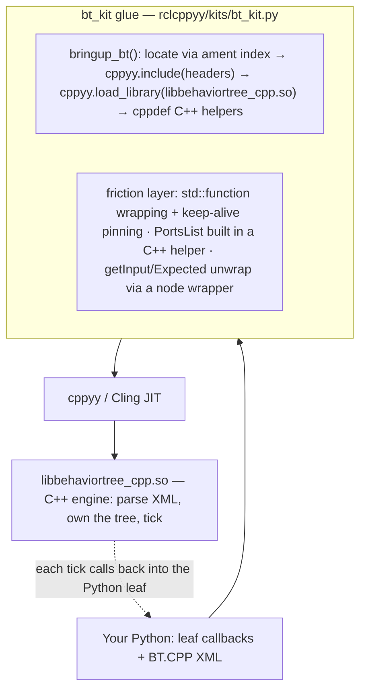

# bt_kit spike — driving BehaviorTree.CPP v4 from Python via cppyy

**Date:** 2026-07-10 · **Env:** pixi `bt` (robostack-jazzy + conda-forge),
`ros-jazzy-behaviortree-cpp 4.9.0`, `cppyy 3.5.0`, Python 3.12.13, linux-64.
**Question:** can the official BehaviorTree.CPP tutorials be written in Python and
executed by the C++ tree engine, with minimal glue and no official binding (none
exists — py_trees is a separate, incompatible library)?

**Verdict: YES, with bounded caveats. GO** for continuing to invest in the kit
strategy, provided the kit hides cppyy from the user (several raw cppyy operations
segfault the process). The v0 API deliberately **mirrors the C++ API** — see §2.

(For the motivation and a C++-vs-Python side-by-side, see [WHY.md](WHY.md); for the
API, see [BT.CPP_KIT.md](BT.CPP_KIT.md).)

---

## How the kit works



Bringup locates the install, JIT-includes the headers, and loads the `.so` so
calls resolve; the friction layer wraps Python callables as `std::function`s
(pinned alive), builds the port list in a C++ helper (Python construction
segfaults — see §1), and unwraps `getInput`/`Expected<T>` behind a small node
object. The engine parses the XML and ticks; each tick calls back into the
Python leaf.

**The same recipe generalizes.** Every future kit (`pcl_kit`, `ompl_kit`,
`ceres_kit`, …) is the same three ingredients: **(1) bringup** — locate the
install (ament index or known prefix), `cppyy.include` its headers,
`cppyy.load_library` its `.so`; **(2) hide the sharp edges** cppyy has for that
library — build STL containers in `cppdef` C++ helpers, keep ownership-crossing
lambdas in C++, pin callables, unwrap awkward return types; **(3) mirror the
library's own API** so a user's (or an LLM's) existing knowledge of that library
transfers 1:1. bt_kit is the worked example — ~180 lines of Python plus a
~40-line C++ helper.

---

## 1. Possible at all? — capability probe matrix

Each capability was probed in isolation from the `bt` env against the installed
4.9.0 headers/library.

| # | Capability | Possible? | How / why |
|---|---|:--:|---|
| 1 | Basic tree: built-in nodes, `createTreeFromText`, `tickWhileRunning` | **YES** | `BT::BehaviorTreeFactory` constructs, parses XML, ticks. Clean. |
| 2 | Python action leaf via `registerSimpleAction` | **YES** | Python callable wrapped in `std::function<NodeStatus(TreeNode&)>`, pinned alive. Ticks and returns status correctly. |
| 3 | Ports + blackboard: `InputPort`/`OutputPort`, `getInput<T>`/`setOutput<T>`, `{bb}` remap | **YES** | Template member calls `node.getInput['std::string'](key)` / `setOutput` work. **But** the `PortsList` (`unordered_map<string,PortInfo>`) must be built in a **C++ helper** — constructing/inserting it from Python **segfaults** cppyy's `MapFromPairs`. |
| 4a | Cross-inheritance: Python class deriving `BT::StatefulActionNode` | **NO** | cppyy's Python-override dispatcher regenerates *all* virtuals, but `StatefulActionNode::tick()`/`halt()` are `final` → `TypeError: no python-side overrides supported (failed to compile the dispatcher code)`. |
| 4b | Stateful/async via a JIT'd C++ shim holding `std::function` hooks | **YES** | `cppyy.cppdef` a `StatefulActionNode` subclass with `std::function` slots for `onStart/onRunning/onHalted`; the builder lambda lives entirely in C++ so the `unique_ptr` never crosses into Python; only the hooks cross. Multi-tick RUNNING→SUCCESS works. |

**One hard failure (4a), one workaround-required (3), everything else clean.**

### Fragility notes (things that worked but felt sharp)
- Building the `PortsList` map in Python **crashes the interpreter** (SIGSEGV,
  no Python traceback). The fix — build it in a one-line C++ helper — is reliable.
- Returning `std::unique_ptr<TreeNode>` *from a Python* `std::function` builder
  fails (`C++ type cannot be converted to memory`). Keeping the builder lambda in
  C++ (Python only supplies the `std::function` hooks) sidesteps it.
- Keep-alive is mandatory: unpinned functors → `callable was deleted` at tick
  time. The kit pins them on the factory and carries them to the tree.
- **Interpreter-exit teardown** (relevant to the mixed-tree demo `t03`, which
  drives rclcpp from inside a tick): the demo previously hard-exited via
  `os._exit(0)` to dodge a feared static-destructor segfault at shutdown. A
  root-cause pass found **no reproducible crash** on the current stack, so the
  dodge is gone — `t03` now exits on a normal `sys.exit`. rclcppyy registers an
  **ordered teardown** (`rclcppyy.shutdown_rclcpp` on `cppyy_kit`'s atexit hook)
  that brings the rclcpp context / DDS layer down before Python finalization. See
  COMMON_PATTERNS.md §14 for the evidence; `test/test_clean_exit.py` is the
  tripwire. bt_kit itself holds no process-global C++ state, so it registers no
  teardown of its own.

---

## 2. API design — thin C++-mirror (shipped)

The v0 API mirrors the C++ library 1:1: `bringup_bt()` returns the patched `BT`
namespace and you use `BehaviorTreeFactory`, `registerSimpleAction` /
`registerSimpleCondition`, `createTreeFromText`, `tickWhileRunning` by their real
C++ names (snake_case aliases exist too), writing the leaf callbacks in Python.
Status is `bt.NodeStatus.SUCCESS` (the real enum, like C++) or the `bt_kit.SUCCESS`
int; they compare equal. The one place it cannot mirror C++ is stateful nodes — C++
uses `registerNodeType<T>()`, impossible for a Python `T` — so the kit adds
`factory.register_stateful(name, PyClass, ports)` whose class exposes
`onStart`/`onRunning`/`onHalted`. See [WHY.md](WHY.md) for the complete
C++-vs-Python side-by-side and [BT.CPP_KIT.md](BT.CPP_KIT.md) for the API.

**Considered and rejected: a sugared decorator DSL** (`@action_node(...)` +
`tree_from_xml`). It was ~2 LOC shorter on tutorial 1 but relied on a module-global
registry (a footgun across multiple trees, re-import, and tests) and forced a
kit-specific DSL the reader must learn instead of reusing existing BT.CPP
knowledge. The thin mirror wins decisively on knowledge transfer and carries no
hidden state, so the decorator shape was dropped entirely — no decorator code
ships.

---

## 3. Glue cost + bringup / JIT time + demo size

| Metric | Value |
|---|---|
| Kit module `rclcppyy/kits/bt_kit.py` | 295 lines total (223 code), of which a **~40-line embedded C++ helper** (`cppdef`) — so ≈ 180 lines of Python glue |
| JIT `cppyy.include("behaviortree_cpp/bt_factory.h")` | **~0.85 s** (one-time) |
| Full `bringup_bt()` (include + `load_library` + `cppdef` + factory patch) | **~0.85 s** (one-time, idempotent) |
| Per-tree registration | negligible (µs) |

Bringup is ~3x faster than the rclcpp bringup (~2.5 s) — BT.CPP's headers are far
smaller than `rclcpp/rclcpp.hpp`.

Official tutorials, XML verbatim, leaves in Python. LOC excludes the XML string,
comments, docstrings, blank lines.

| Demo | User Python LOC | What it exercises |
|---|:--:|---|
| `t01_first_tree.py` | **24** | 4 leaves (1 condition + 3 actions), Sequence, tick |
| `t02_ports.py` | **16** | input port read, output port write, `{blackboard}` roundtrip |

Verified output:
```
# t01
[ Battery: OK ]
GripperInterface::open
ApproachObject: approach_object
GripperInterface::close
# t02
Robot says: hello world
Robot says: The answer is 42
```

---

## 4. Runtime metrics

Fixed tree: `Sequence` of 3 leaves each returning SUCCESS immediately. One tick =
one full traversal. 2 s warm window per variant, JIT/bringup excluded. One run on
this machine (indicative, not statistically rigorous):

| Variant | ticks/s | µs/tick |
|---|--:|--:|
| (a) C++ JIT leaves (engine + leaves at C++ speed) | ~1,280,000 | ~0.78 |
| (b) Python leaves through bt_kit | ~630,000 | ~1.58 |
| (c) pure-Python sequence loop (no C++ engine) | ~7,700,000 | ~0.13 |

**Reading these numbers honestly:**
- Crossing into Python per leaf costs **~2x** vs C++ leaves (~0.3 µs of boundary
  cost per leaf). Cheap for orchestration.
- The C++ engine is **~10x slower than a trivial 3-item Python loop** for this
  degenerate tree. Expected, and the key insight: **the C++ engine is not a speed
  play** for tiny trees — its per-tick cost (node traversal, status propagation,
  blackboard) dwarfs a bare loop. Its value is the *engine* (reactive/parallel
  control nodes, decorators, XML authoring, logging, Groot), not tick throughput.
- (c) is a **floor**, not a fair py_trees stand-in: py_trees (a real pure-Python
  BT with tree/blackboard semantics) carries its own traversal overhead and would
  land far below this trivial loop — plausibly near or below (b). py_trees is **not
  packaged** for robostack-jazzy/conda-forge (`pixi search` finds nothing), so the
  apples-to-apples contrast was dropped; (c) stands in as "what you'd hand-write
  without the kit."

At ~630k ticks/s, Python-leaf trees tick far faster than any real robot control
rate (typically 10–1000 Hz), so the boundary cost is a non-issue in practice.

---

## 5. Gap resolution — deep pass (2026-07-11)

The v0 GAPS were systematically attacked. Evidence for the "WORKS" verdicts is the
kit test suite `test/test_bt_kit.py` (7 tests; `pixi run -e bt test-bt` → all green;
auto-skips without BT so the default suite stays 6 passed) plus the probes noted.
Numbers are provisional — a parallel kit spike shared this machine.

| Gap | Verdict | Evidence |
|---|:--:|---|
| 1. Typed ports (int/double/bool/vectors) | **WORKS** | `ports={"count": int, "items": [float]}`; `get_input(k, int)` and `set_output` (type inferred). int/double/bool/`vector<double>` parsed from XML literals + typed blackboard roundtrip. `test_typed_ports_roundtrip`. |
| 2. Stateful multi-instance | **WORKS** | Builder calls back into Python per node → a fresh object per node instance (handle-dispatched). Two `<CountTo n="2"/"4">` keep independent counts. `test_stateful_multi_instance`. |
| 3. Observability | **WORKS** | `add_cout_logger` / `add_file_logger` (7.6 KB `.btlog`) / `observe().counts()` / `add_groot2_publisher`. The `.so` is built with ZMQ (libzmq linked); Groot2Publisher constructs and binds. `test_observer_counts`. |
| 4. GIL / Parallel + Reactive | **WORKS (characterized)** | Parallel and ReactiveSequence tick Python leaves on the single tick thread; a sleeping leaf releases the GIL and a background-thread spin does not deadlock (main thread ran 40 iters concurrently). Rules below. |
| 5. XML error ergonomics | **WORKS** | `BtXmlError` with one clean line (`RuntimeError: Error at line 4: -> Node not recognized: X`), no C++ signature wall. `test_xml_error_is_readable`. |
| 6. Subtrees + v4 scripting/preconditions | **WORKS** | SubTree composition (needs `main_tree_to_execute`), `<Script code="x:=42"/>`, `_skipIf` preconditions — engine-side, free through the kit. `test_subtree_composition`. |
| 7. Kit tests + `test-bt` | **WORKS** | `test/test_bt_kit.py` auto-skips without BT (default suite: 6 passed / 7 skipped); `pixi run -e bt test-bt` → 7 passed. |
| 8. JIT→AOT "freeze" | **PARTIAL / BLOCKED** | Dictionary builds and loads (~0.02 s) but does **not** skip the header parse — see below. |

### Rules of thumb (Gap 4 — GIL/concurrency)
- Kit leaves (SimpleAction/SimpleCondition, `register_stateful`) are always ticked
  in the tree's own thread — no leaf runs on a C++ worker thread, so the GIL is a
  non-issue in normal use. BT's `ParallelNode` is cooperative bookkeeping, not OS
  threads: Python leaves under it run sequentially (no true parallelism, but no
  contention either).
- A leaf must not busy-block: return `RUNNING` and let the tick loop re-enter. A
  leaf that sleeps / does I/O releases the GIL and is safe even when the tree is
  spun from a background Python thread (verified: no deadlock).
- `ThreadedAction` is deliberately not exposed (it would run the callback on a C++
  worker thread and need explicit GIL handling).

### Residual gaps (still true)
- `registerNodeType<T>` for a Python `T` remains impossible → custom **control
  nodes / decorators** authored in Python still need a JIT'd C++ shim.
- Ports are bidirectional and string/scalar/vector-typed; **directioned**
  declarations and arbitrary **struct/JSON** port types need a C++ type (via
  `RegisterJsonDefinition`), so Python-defined struct ports aren't reachable.
- Groot2 publishing binds but was not verified against a live Groot2 GUI (none
  available locally — binding is the signal).
- Keep-alive discipline (pin Python callables) and the container-segfault rule are
  handled inside the kit; any raw-cppyy use reintroduces them.

### Gap 8 — JIT→AOT freeze probe (findings)
Bringup is **89% header JIT-parse**: `cppyy.include("bt_factory.h")` **0.826 s**,
`load_library` 0.015 s, `cppdef(glue)` 0.044 s, first factory+tick 0.041 s
(total ~0.93 s). Tooling present: `genreflex`, `rootcling`, `cppyy-generator`,
`cppyy.load_reflection_info`. A ROOT dictionary was built end-to-end:
- `#pragma link C++ defined_in "<header>"` captured only the namespace (rootcling
  skips classes with deleted copy-ctors/templates); explicit `#pragma link C++
  class BT::X+;` is required and does capture them.
- `rootcling` → `dict.cxx` + `_rdict.pcm` + `.rootmap`, compiled to a `.so`;
  `load_reflection_info` loads it in **~0.02 s**.
- **The header parse is not eliminated.** With the dict loaded and *no*
  `cppyy.include`, the first `BehaviorTreeFactory()` still cost **0.799 s** — Cling
  lazily parses the header on first class use regardless of the ROOT dictionary.
  The dict supplies reflection/autoload metadata, not a precompiled AST.

**Verdict: PARTIAL / BLOCKED.** The ROOT-dictionary route does not deliver the L1
freeze. Skipping the parse needs Cling to load a **precompiled header / C++ module**
for `bt_factory.h` (the mechanism cppyy uses for its own std PCH): a
`module.modulemap` + `-fmodules` build of the BT headers, or a Cling PCH,
version-matched to cppyy-cling 6.32.8. That is a dedicated sub-project, not a quick
win; the ~0.85 s bringup is one-time and idempotent per process in the meantime.

---

## 6. Recommendation — GO (curated kit that mirrors the C++ API)

The core hypothesis is **proven**: official BT.CPP tutorials run **verbatim XML**
on the **C++ engine** with leaves in **16–24 lines of Python**, ~0.85 s bringup,
correct output — and there is no competing official Python binding, so this is a
genuine "impossible → possible" result. Stateful/async, the riskiest probe, works
via the C++-shim escape hatch.

The gaps are real but bounded and mostly about *breadth* (typed ports, control
nodes, Groot) rather than *feasibility*. Two findings shape the strategy:
- **Mirror the C++ API, don't invent a DSL.** LLMs already know the BT.CPP
  tutorials; a 1:1-named surface (`BehaviorTreeFactory`, `registerSimpleAction`,
  `createTreeFromText`, `tickWhileRunning`) lets an agent transfer that knowledge
  with almost no kit-specific learning, and avoids the hidden-state footguns of a
  sugared registry (see §2).
- **cppyy must stay behind the kit.** The segfault-prone container handling and
  the `registerNodeType<T>`/`final`-virtual limits mean an agent pointed at raw
  cppyy would produce process crashes with no traceback. The kit removes every
  sharp edge encountered here while keeping the user code C++-shaped.

The deep pass (2026-07-11, §5) closed most of the v0 gaps: typed ports, per-node
stateful instances, loggers/Groot2/observer, readable XML errors, subtrees, and a
skip-safe test suite all landed. What remains is genuinely harder — Python-authored
control/decorator node *types* (need generated C++ shims) and the L1 "freeze"
(needs a Cling C++ module/PCH, not a ROOT dictionary — §5 Gap 8). Neither is a
blocker for using the kit today.

**Next investments, in priority order:** (a) Python-authored control/decorator
nodes via generated C++ shims; (b) directioned + struct/JSON ports; (c) the L1
freeze via a Cling C++ module for `bt_factory.h`; (d) live Groot2 verification.

---

## 7. Generic lessons for cppyy_kit

These generalized beyond BT.CPP and are now maintained as the shared,
library-independent catalog in **[../kits/COMMON_PATTERNS.md](../kits/COMMON_PATTERNS.md)**
(the recipe, keep-alive, function crossing both ways, container/segfault traps,
templates, GIL rules, error prettify, and the AOT/L1 finding) — implemented in
`rclcppyy/kits/cppyy_kit.py` and confirmed by both bt_kit and pcl_kit. The
BT-specific evidence stays in this report (§1 probe matrix, §5 deep-pass verdicts,
§5 Gap 8 AOT probe).

