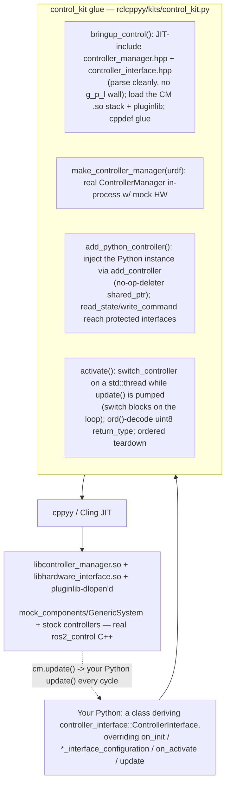

# control_kit spike — writing a ros2_control controller in Python, inside the real controller_manager

**Date:** 2026-07-11 · **Env:** pixi `control` (robostack-jazzy + conda-forge),
`ros-jazzy-ros2-control` (controller_manager / controller_interface / hardware_interface),
`ros-jazzy-ros2-controllers`, `cppyy 3.5.0`, Python 3.12, linux-64. ROS_DOMAIN_ID=49.
**Question:** ros2_control has **no Python controller story** — a controller is a C++
class deriving `controller_interface::ControllerInterface`, exported via a pluginlib
`plugin_description.xml`, built by CMake/ament into a `.so`, and spawned into a
`controller_manager` process. Can we instead write the controller in **Python** and run
it **inside a real `controller_manager::ControllerManager`** in our own process, against
mock hardware, driven by the real `read`→`update`→`write` loop — the ⚠️ UNPROVEN item on
the exposure note?

**Verdict: YES. GO.** All four stages reached the real thing. A `ControllerManager` is
constructed in-process from a URDF string with `mock_components/GenericSystem` hardware
(Stage 1); a **stock C++ controller** (`forward_command_controller`) is loaded via
pluginlib, configured, activated, and commanded through the mock hardware (Stage 2); and
**a PD controller written as a plain Python class that derives the real
`ControllerInterface`** is injected into that CM and driven by the real update loop,
tracking a moving reference (Stage 3). The Python controller's `update()` costs **2.57
µs/cycle** vs **0.85 µs** for the C++ baseline (3.0×) and holds **100 Hz solidly / 1 kHz
with occasional GC-induced deadline misses** (Stage 4). The "dream" route — cross-language
inheritance of the framework's own base class — **shipped**; the "bridge" route was not
needed. **ros2_control does NOT hit MoveIt's generate_parameter_library Cling wall**: the
CM and controller_interface headers JIT-parse cleanly.

(For the stock-ros2_control ceremony contrast see [WHY.md](WHY.md); for the API cheat
sheet see [CONTROL_KIT.md](CONTROL_KIT.md).)

---

## How the kit works

`bringup_control()` JIT-includes the CM/controller-interface headers and loads the `.so`
set; ros2_control's own classes are then used **directly**
(`controller_manager::ControllerManager`, `controller_interface::ControllerInterface`).
The kit's helpers exist for four specific frictions (§2): parameterized CM construction,
cross-inheritance **injection**, protected-interface **access**, and **off-thread
activation**. Same three-ingredient recipe as the prior kits (bringup → hide the cppyy
edges → mirror the API); the novel piece is that the user's Python class *derives the
framework's own virtual base and the framework calls its `update()` in the control loop*.
control_kit is **654 lines** (heavy docstrings per the mirror convention), of which **~94
are embedded C++ glue** (executor factory, threaded switch, interface accessors, the
injector).

---

## 1. Stage matrix (each stage is a checkpoint)

| # | Stage | Result | Evidence |
|---|---|:--:|---|
| 1 | **In-process ControllerManager** from a URDF string + `mock_components/GenericSystem`, RT loop spinning | **WORKS** | `ControllerManager(executor, urdf, activate_all=true, ...)` builds the ResourceManager internally; `is_resource_manager_initialized()==true`, `get_update_rate()==100`; mock system `configure`+`activate`d; `read`/`update`/`write` loop ran, exit 0. |
| 2 | **Stock C++ controller** via the rig | **WORKS** | `forward_command_controller/ForwardCommandController` loaded by pluginlib (`load_controller`), params set on its node, `configure`→INACTIVE, `activate`→**ACTIVE (lifecycle id 3)**; a `[0.5,-0.3]` command published on `/fwd/commands` flowed topic→controller→hardware (read back off the command interface = `[0.5000,-0.3000]`). `demo-control-rig` exit 0. |
| 3 | **THE PYTHON CONTROLLER** (Route A, cross-inheritance) | **WORKS** | `PythonPDController(control_kit.ControllerInterface)` overriding `on_init` / `command_interface_configuration` / `state_interface_configuration` / `on_configure` / `on_activate` / `on_deactivate` / `update`; injected via `add_controller`; the CM called every override, activated it, and drove its `update()` at 100 Hz — it **tracked a moving cosine reference, max \|err\| 0.050 rad** on the mock joints. `demo-control-python` exit 0. |
| 4 | **Measure** (Python vs C++ under the same rig) | **DONE** | §4 numbers. Python `update()` 2.57 µs vs C++ 0.85 µs; both hold 100 Hz (0 late) and 1 kHz (~0.45 % late); GC pause 2.29 ms is the RT hazard. |

**Zero hard failures.** Every stage reached real ros2_control C++.

---

## 2. The bring-up mechanics (PRECISE — this is the novel pattern)

### 2.1 No generate_parameter_library Cling wall (the key difference from MoveIt)
MoveIt's convenience headers SIGSEGV Cling because they pull `generate_parameter_library`
output (`*_parameters.hpp` → fmt/rsl) — docs/moveit_kit/REPORT.md §2.1. **ros2_control does
not have this problem at the surface we use.** Probed out-of-process (moveit lesson), these
all JIT-parse **cleanly**: `controller_interface/controller_interface_base.hpp`,
`controller_interface/controller_interface.hpp`, `hardware_interface/resource_manager.hpp`,
`controller_manager/controller_manager.hpp`. The CM's own parameters use a
forward-declared `ParamListener`/`Params` defined in the `.cpp` (not the header), and
`controller_interface_params.hpp` is a **hand-written struct** (pulls `joint_limits.hpp`,
which is also plain), so the full `ControllerManager` class is directly reachable. The
per-controller g_p_l headers (e.g. `forward_command_controller_parameters.hpp`) *are*
generated, but they live inside the controller `.so` that pluginlib **dlopen's** — cppyy
never parses them. Net: the whole CM stack is JIT-parseable; there was **no wall to work
around**.

### 2.2 Route A — cross-inheritance + injection (what the prize took)
A Python class derives `controller_interface::ControllerInterface` and overrides its
plain virtuals (`on_init`, `update`, `command_interface_configuration`,
`state_interface_configuration` are pure virtual and **not `final`**; `on_configure` etc.
are plain virtuals from `LifecycleNodeInterface`). Four sharp edges, each fenced by the kit:

- **Derive the *compiled* base, not a JIT'd one.** Deriving an intermediate class defined
  in a `cppyy.cppdef` breaks cppyy's override-dispatcher generation — the `on_init` return
  type (a `using CallbackReturn` alias) resolves to `<unknown>` and class creation fails
  (`no python-side overrides supported`). Deriving the **compiled** `ControllerInterface`
  directly works: the CM calls every Python override.
- **`CallbackReturn` is a `using` alias that cppyy resolves to Python `int`.** The real
  enum is `rclcpp_lifecycle::node_interfaces::LifecycleNodeInterface::CallbackReturn`
  (SUCCESS=97, FAILURE=98, ERROR=99); the kit exposes it as `control_kit.CallbackReturn`
  from that full path (accessing `controller_interface::CallbackReturn` gives `int` and
  `.SUCCESS` then raises `AttributeError`).
- **Injection via a no-op-deleter `shared_ptr`.** `ControllerManager::add_controller` (a
  public method — grepped from the header) takes a `ControllerSpec` whose `.c` is a
  `ControllerInterfaceBaseSharedPtr`. Assigning that from Python fails (`C++ type cannot
  be converted to memory` — cppyy cannot copy a `shared_ptr` aliasing a cross-inherited
  object). The kit assembles the spec **in C++** and wraps the raw base pointer in a
  `shared_ptr` with a **no-op deleter** — Python owns the object (pinned by the rig), the
  CM must not free it. `add_controller` does **not** consult pluginlib (the instance is
  supplied), so no `.so`/xml is needed.
- **Protected interfaces via a same-layout accessor.** A controller reads/writes hardware
  through the *protected* `state_interfaces_` / `command_interfaces_` members, invisible
  to a Python subclass. `ControllerInterfaceBase` is the offset-0 base of every controller,
  so a `struct IfaceAccessor : ControllerInterfaceBase` reads those members at their true
  offsets; the kit exposes `read_state` / `read_command` / `write_command` /
  `n_state`/`n_command` as free functions taking the controller (Python passes `self`,
  which cppyy upcasts to the base pointer).

### 2.3 Off-thread activation (the blocking-switch friction)
`switch_controller` blocks until the `update()` loop applies the switch (it is done in
`ControllerManager::update()`), so it cannot be called from the loop-driving thread.
Two cppyy facts shaped the fix: **`std::async` does not JIT in Cling** (symbol
materialization failure for the async-state template instantiation), but a **plain-function
`std::thread` does**; and **cppyy does not release the GIL on a blocking C++ call**
(measured: a background Python thread advanced its counter only once during a 2 s C++
`sleep`), so the switch cannot run on a Python thread while the main thread pumps `update()`.
The kit therefore runs `switch_controller` on a C++ `std::thread` (a static request struct
carries the args; atomics report completion) and pumps `update()` from Python until it
completes. Only `read`/`update`/`write` are pumped during the switch — spinning the
executor concurrently races the switch's mutation of the executor's node set.

### 2.4 uint8_t enums cross as a 1-char str
`controller_interface::return_type` is `enum class : std::uint8_t`. A **returned** value
(from `configure_controller`, `switch_controller`, a controller's `update`) crosses as a
1-char Python `str` (`'\x00'`==OK, `'\x01'`==ERROR) — `int('\x00')` raises. The enum
**member** `return_type.OK` is a proxy that `int()`s fine. `control_kit.ok(v)` handles both
(`ord` on a str, else `int`). The same applies to a uint8 enum read back from a **struct
member** (`InterfaceConfiguration.type`).

### 2.5 Load before the loop; and teardown
- **Load/configure controllers *before* the first `update()`.** Once `update()` has run,
  the CM manages its controller list with real-time-safe swaps that block a synchronous
  `load_controller`/`add_controller` until the loop pumps again — which **deadlocks** a
  load issued from the (now-stopped) loop thread. This mirrors how `ros2_control_node`
  works (configure the stack, then spin the RT loop). The rig **guards** this: `load_*` /
  `add_*` after `update()`/`activate()` raise a clear error instead of hanging.
- **Teardown.** The CM owns a `pal_statistics` **async publisher thread**; if the CM
  outlives the rclcpp context the process cores at exit (`context cannot be slept with
  because it's invalid` → SIGSEGV, reproduced). The rig registers a teardown (via
  `cppyy_kit.register_teardown`, so it runs at `atexit` **before** rclcpp shutdown) that
  deactivates active controllers and resets the CM (C++ static ref + Python ref) — the CM
  destructor then joins the pal_statistics thread while the context is still valid →
  deterministic exit 0. **Never `unload_controller` a cross-inherited controller at
  teardown** (it hung in probing); let the CM destructor clean it up. A benign
  `class_loader` "SEVERE WARNING … will NOT be unloaded" and `pal_statistics` "registry
  not found" warnings still print; neither affects the exit code.

### 2.6 Miscellany
`std::make_shared<rclcpp::executors::SingleThreadedExecutor>()` from Python hit cppyy
overload-cache flakiness (worked in one probe, failed verbatim in the next); building it in
a C++ factory is reliable (Pattern 6). Controller params (`joints`, `interface_name`) must
be **set** on the controller's own node after load (the controller's ParamListener
*declares* them empty in `on_init`; Jazzy controller nodes do **not** auto-declare from CM
overrides — `define_custom_node_options` only sets `enable_logger_service`), so the kit
`set_parameter`s them before `configure`.

---

## 3. Route A vs Route B — which shipped and why

The task asked to probe both the **cross-inheritance** route (A) and the **compiled
pluginlib bridge** (B, the direct-compile `.so` whose `update()` delegates through a C-ABI
function pointer Python sets). **Route A shipped.** It works end to end (§1/§2), and it is
strictly the better developer experience: a genuine Python class with a real `update()`
method, injected in three lines, **no compile step, no plugin xml, no CMake**. Route B was
**not built** — it would add a build step and reduce the controller to a C function
pointer, for no capability Route A lacks in the in-process rig.

**When Route B would still be the answer (honest boundary):** Route A's controller is
injected via `add_controller`, so it is **not loadable by name via pluginlib** — it cannot
be spawned by the standard `ros2 control` spawner into a *separately launched*
`ros2_control_node`, and it only runs while the Python process drives the loop. If you need
a controller that a stock (C++) `controller_manager` process loads by type name, that
requires a compiled pluginlib `.so` (Route B) — feasible via the existing L2 direct-compile
recipe (`scripts/freeze/build_l2_node.py`) plus the `HandleRegistry`/C-ABI-setter pattern
(COMMON_PATTERNS §5), and it is exactly the **graduation path** in §4. For "write and run a
controller from Python", Route A wins.

---

## 4. Stage 4 — the honest real-time verdict

Update loop held for 8 s at each rate; per-cycle wall-clock intervals; "late" = interval >
1.5× the target period. Python controller (cross-inherited PD) vs stock C++
`forward_command_controller`, same rig, same mock hardware. **Shared machine — directional.**

| controller | pure `cm.update()` | 100 Hz achieved / late | 100 Hz interval ms (p50/p95/p99/max) | 1 kHz achieved / late | 1 kHz interval ms (p50/p95/p99/max) |
|---|--:|:--:|:--:|:--:|:--:|
| **C++ baseline** (forward_command) | **0.85 µs** | 100.0 Hz / 0 of 800 | 10.0 / 10.19 / 10.40 / 10.55 | 1000.0 Hz / 37 of 8000 | 1.00 / 1.07 / 1.33 / 2.09 |
| **Python** (cross-inherited PD) | **2.57 µs** | 100.0 Hz / 0 of 800 | 10.0 / 10.30 / 10.45 / 11.11 | 1000.0 Hz / 36 of 8000 | 1.00 / 1.09 / 1.28 / 3.53 |

- **update() dispatch: Python 2.57 µs vs C++ 0.85 µs (3.0×).** The 3× is the cross-language
  call + the per-cycle Python arithmetic; in absolute terms **2.57 µs is negligible** —
  0.026 % of a 10 ms (100 Hz) period, 0.26 % of a 1 ms (1 kHz) period. Throughput is not the
  constraint.
- **100 Hz: rock solid for both.** Zero late cycles; the ~0.2–0.5 ms jitter is `time.sleep`
  / OS scheduling, indistinguishable between Python and C++. A 100 Hz Python controller is
  **production-viable for soft-real-time** (development, HIL, sim, teleop).
- **1 kHz: works on average, misses occasionally.** Both hit 1000 Hz mean with ~0.45 % late
  cycles (36–37 / 8000). The Python **tail is worse** (max 3.53 ms vs 2.09 ms): a
  **`gc.collect()` pause measured at 2.29 ms** exceeds a 1 ms period, so a GC that fires
  mid-loop blows a single deadline — visible in the Python max. **GIL note:** the loop is
  single-threaded, so there is no GIL *contention*; the RT hazard is GIL-holding **pauses**
  (GC, allocation, any background Python thread) rather than throughput.
- **Verdict: prototyping-grade and soft-real-time (100 Hz–1 kHz average) — not
  hard-real-time.** The per-call cost is a non-issue; the disqualifier for hard-RT is
  Python's non-deterministic pauses (GC/allocator/GIL), not this kit.

**Where lowering fits (the graduation story):** prototype the controller in Python against
the *real* CM with this kit — the fast, no-build iteration loop. Once the control law is
validated, **lower `update()` to a native C++ pluginlib controller** (the proven L2
direct-compile path, `scripts/freeze/build_l2_node.py`) for hard-RT deployment into a stock
`ros2_control_node`. The Python and C++ controllers share the same interface contract, so
the lowering is mechanical and the behaviour is already verified.

---

## 5. GAPS — what a user hits next (honest)

1. **In-process only / not spawner-loadable.** Route A's controller runs while the Python
   process drives the loop and is injected via `add_controller`, not pluginlib — it is not
   loadable by name into a separately-launched `ros2_control_node` (that is Route B / §3).
2. **First-`update()` JIT stall.** The first cross into a Python `update()` JIT-compiles the
   call wrapper — a **one-time ~29 ms** cost that shows as a single CM "Overrun might occur"
   warning on cycle 0. It does not recur; a per-controller warmup (exercise one `update()`
   before the timed loop) would move it. `warmup()` currently front-loads CM construction,
   not the per-controller dispatch.
3. **Not hard-real-time** (§4): GC/GIL pauses can miss a 1 kHz deadline.
4. **Mock hardware only in the demos.** `mock_components/GenericSystem` mirrors command→state;
   a real `SystemInterface` plugin loads the same way (pluginlib), untested here.
5. **Chainable controllers** (`ChainableControllerInterface`, reference interfaces) not
   probed — the same cross-inheritance mechanic should apply.
6. **Deprecated `get_value()`** is used by the interface accessor (returns `double`
   directly); `get_optional<T>()` is the non-deprecated form if warnings matter.
7. **First-run PCH rebuild** (~a minute, once/machine) and the rclcpp header JIT dominate
   cold start; freeze (FREEZE.md) would help.

---

## 6. Generic-lesson candidates for cppyy_kit (for the lead — COMMON_PATTERNS/README untouched)

- **Cross-inheritance of a *framework* base + injection via a no-op-deleter `shared_ptr`.**
  Sharpens Pattern 16/17a: to hand a cross-inherited Python instance to a C++ container that
  stores it by `shared_ptr`, wrap the raw base pointer **in C++** with a no-op deleter
  (Python keeps ownership; pin the instance) — assigning a `shared_ptr` aliasing a
  cross-inherited object *from Python* fails (`C++ type cannot be converted to memory`).
- **Derive the *compiled* base, never a JIT'd (`cppdef`) intermediate.** cppyy's override
  dispatcher fails to resolve return types (`<unknown>`) when the base is JIT-defined.
  Access protected base members via a **same-layout accessor** (`reinterpret_cast` to a
  `struct : Base` that reads them) exposed as free functions.
- **`using`-alias enums resolve to Python `int`.** Reference the real nested enum type
  (`Outer::Inner::Enum`) — the alias loses the enum-ness.
- **uint8_t-backed `enum class`: a returned value / struct-member read crosses as a 1-char
  `str` (`ord` it); the enum member is a proxy (`int()`s).** Generalises Pattern 11 to the
  unsigned-char underlying type.
- **`std::async` does not JIT in Cling; a plain-function `std::thread` does.** For a blocking
  C++ API that must run off the calling thread.
- **cppyy does not release the GIL on a blocking C++ call** (measured). A blocking C++ call
  must run on a **C++** thread if Python work must proceed concurrently — not a Python thread.
- **`std::make_shared<T>()` of some classes is flaky from Python** (overload-cache
  sensitivity); build in a C++ factory (Pattern 6).

---

## 7. Recommendation — GO

The thesis holds: a **ros2_control controller written in Python runs inside the real
`controller_manager`**, driven by the real update loop against mock hardware — the
exposure-note's UNPROVEN item, proven. The "dream" route (cross-inheritance of the
framework's own `ControllerInterface`) shipped; ros2_control's headers are Cling-clean, so
no g_p_l wall had to be worked around; the specific frictions (injection, protected
interfaces, blocking switch, uint8 enums, teardown) are understood and fenced in ~94 lines
of C++ glue. The honest limits are **hard-real-time** (Python's GC/GIL pauses, not this kit)
and **spawner-loadability** (Route B territory) — not feasibility.

For the **pluginlib-bridge pattern generally**: the reusable win here is *cross-inheritance
of a pluginlib base + in-process injection into the manager* — which Nav2's controller /
planner / behavior plugins (all `pluginlib` bases) would reuse verbatim where a manager
exposes an add/inject API; where it only loads by name, Route B (compiled `.so` + C-ABI
setter) is the fallback, and the graduation path from Python-prototype to native plugin is
the same. **GO** for the kit and for the pattern.
