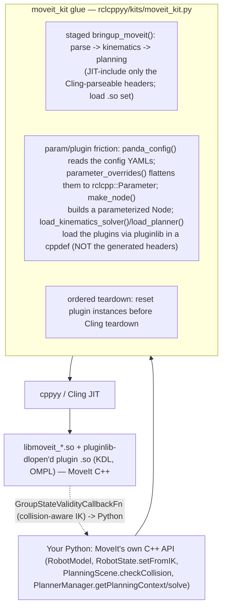

# moveit_kit spike — driving the full MoveIt 2 C++ API from Python via cppyy

**Date:** 2026-07-11 · **Env:** pixi `moveit` (robostack-jazzy + conda-forge),
`ros-jazzy-moveit 2.12.4`, `ros-jazzy-moveit-py` (contrast), panda test config,
`cppyy 3.5.0`, Python 3.12.13, linux-64.
**Question:** MoveIt's official Python binding, `moveit_py`, is an explicit,
hand-maintained **subset** of the C++ API. Can we drive the **full** MoveIt C++
stack — `moveit::core::RobotModel`, `PlanningScene`/FCL, the KDL kinematics plugin,
the OMPL planning pipeline — from Python via cppyy against the installed 2.12.4,
including MoveIt's **parameter- and plugin-driven** bring-up (a plugin loaded via
pluginlib, reading node parameters), booted from a **Python-created** `rclcpp::Node`?

**Verdict: YES. GO.** All four probe rungs reached the real thing: (a) `RobotModel`
built from URDF+SRDF strings + FK; (b) the **KDL kinematics plugin loaded in-process
via pluginlib** and `RobotState::setFromIK` solving (pos err ~1e-11); (c)
`PlanningScene` + **FCL** self- and world-collision (~129k self-checks/sec); (d) the
**real OMPL `PlannerManager` plugin** planning a Panda motion (RRTConnect, joint- and
pose-goals, success). The novel pattern — booting MoveIt's plugin/param stack from a
Python node — **works**, with two frictions documented precisely below because the
**ros2_control kit depends on this exact mechanic**.

(For the moveit_py contrast and a side-by-side, see [WHY.md](WHY.md); for the API and
copy-paste patterns, see [MOVEIT_KIT.md](MOVEIT_KIT.md).)

---

## How the kit works



`bringup_moveit()` JIT-includes MoveIt's headers and loads the `.so` set; MoveIt's own
API is then used **directly** on the returned `moveit` namespace (and the sibling
`planning_scene` / `collision_detection` / `kinematic_constraints` namespaces). The
kit's helpers exist for the **param/plugin friction** that is not sugar: assembling
node parameters from the config YAMLs, creating a parameterized node, and loading the
kinematics/planning plugins via pluginlib in a way that dodges the header that will not
parse. **Same three-ingredient recipe** as bt/pcl/ompl (bringup → hide cppyy edges →
mirror the API); MoveIt adds a fourth thing the others didn't: a **plugin+parameter
bootstrap**. moveit_kit is **676 lines** (heavy docstrings per the mirror convention),
of which **~131 are embedded C++ glue** (the pluginlib loaders + plan / pose /
DisplayTrajectory helpers) — more embedded C++ than any prior kit, because the plugin
bootstrap and a few Eigen/ownership corners are cleanest in C++.

---

## 1. Possible at all? — capability probe matrix (staged by bring-up depth)

Each rung was probed in isolation from the `moveit` env against MoveIt 2.12.4 and the
panda config. Scratch probes and their output are the evidence.

| # | Rung (increasing bring-up depth) | Result | Evidence |
|---|---|:--:|---|
| a | **Parse-only `RobotModel`** from panda URDF+SRDF **strings**; FK via `RobotState` | **WORKS** | `urdf::parseURDF` → `srdf::Model::initString` → `moveit::core::RobotModel(urdf, srdf)`; no node, no params. FK of the `ready` state: `panda_link8` = (0.307, 0.000, 0.590). Build+parse ~230 ms; header JIT ~2 s. |
| b | **KDL IK** — does the kinematics plugin load in-process (pluginlib + params)? | **WORKS** (via direct pluginlib) | KDL plugin loaded through `pluginlib::ClassLoader<kinematics::KinematicsBase>` in a `cppdef`, `initialize`d against a plain Python `rclcpp::Node`, wired onto the group; `setFromIK` solved with **pos err 1.0e-11** in ~36 ms. The convenience header path (`robot_model_loader.hpp`) is **blocked** — see §2. |
| c | **PlanningScene + FCL** self- + world-collision from Python | **WORKS** | `PlanningScene(model)` (detector **FCL**); self-collision correct (`ready` clear, all-zeros colliding); a world box in the path detected by `checkCollision`. **~28.8k full checks/sec** (world+self, Python loop) / **~129k self-checks/sec** (bench). |
| d | **Planning** — the real pipeline | **WORKS** (real OMPL `PlannerManager`) | MoveIt's `ompl_interface/OMPLPlanner` plugin loaded via pluginlib, initialized with **111 parameters flattened from `ompl_planning.yaml`**; it selected `geometric::RRTConnect` from the config and solved a panda_arm joint-goal (err_code 1, 4 waypoints, ~2 ms) and a pose-goal (10 waypoints, ~11 ms). `MoveItCpp`/`PlanningPipeline` header path **blocked** — see §2; loading the `PlannerManager` plugin directly is what MoveItCpp does internally anyway. |
| e | **Contrast** — moveit_py, and one capability it cannot express | **VERIFIED** | Collision checks head-to-head (§4). moveit_py's `set_from_ik(group, pose, timeout)` has **no validity-callback slot**; our `setFromIK` invokes a Python `GroupStateValidityCallbackFn` in the C++ IK loop (70–122 invocations, rejecting in-collision candidates). moveit_py also cannot do **standalone IK** (no solver from `RobotModel(urdf, srdf)`). |

**Zero hard failures at the capability level.** The two "blocked" items are *header
parse* blocks with a clean, documented workaround (§2), not capability gaps: every rung
reached the real MoveIt code.

---

## 2. The param/plugin bring-up mechanics (PRECISE — the ros2_control kit builds on this)

This is the novel pattern the spike was really about. MoveIt's kinematics and planning
are **pluginlib plugins configured from ROS node parameters**. Booting that from a
cppyy/Python-created node has three moving parts; each had a sharp edge.

### 2.1 The Cling wall: `generate_parameter_library` headers crash the parser
MoveIt's convenience loaders pull **generated** parameter headers:
`robot_model_loader.hpp` → `kinematics_plugin_loader.hpp` →
`moveit_ros_planning/kinematics_parameters.hpp`; `planning_pipeline.hpp` /
`moveit_cpp.hpp` → `planning_pipeline_parameters.hpp`. These are emitted by
`generate_parameter_library` and include `fmt/*` + `rsl/*` (static_string,
static_vector, parameter_validators) with modern C++ that **crashes Cling's parser**
(a SIGSEGV inside `clang::Sema` during `TCling::Declare`, no Python traceback) — the
Pattern-9 hazard from COMMON_PATTERNS, hit for real. Confirmed by bisection: the crash
is isolated to the `*_parameters.hpp` includes; `robot_model.hpp`, `robot_state.hpp`,
`kinematics_base.hpp`, `planning_interface.hpp`, `rdf_loader.h` all parse cleanly.

**Consequence:** you cannot `cppyy.include` `robot_model_loader.hpp`,
`kinematics_plugin_loader.hpp`, `planning_pipeline.hpp`, or `moveit_cpp.hpp`.

**Workaround (the whole kit design):** don't use those convenience wrappers. Load the
plugins **yourself** via `pluginlib::ClassLoader` against the *clean* base headers
(`kinematics_base.hpp`, `planning_interface.hpp`). This is exactly the mechanic
MoveItCpp uses internally, minus the generated header — the compiled plugin `.so` still
contains all the generated code; we just never ask Cling to parse it.

### 2.2 Loading a pluginlib plugin in-process from cppyy — what it takes
A `cppyy.cppdef` C++ helper (not Python, so the STL/lambda/`shared_ptr` work stays in
C++ — Patterns 6/5) that:
1. constructs `pluginlib::ClassLoader<Base>(package, "Base::type")` — for kinematics
   `("moveit_core", "kinematics::KinematicsBase")`, for planning
   `("moveit_core", "planning_interface::PlannerManager")` (the base class lives in
   `moveit_core`);
2. `loader->createUniqueInstance("<plugin/Name>")` — the lookup name from the plugin's
   `plugin_description.xml`, which pluginlib finds via the **ament index** (populated
   from `AMENT_PREFIX_PATH`; no extra work in-process). pluginlib **dlopen's the plugin
   `.so` itself** (`libmoveit_kdl_kinematics_plugin.so`, `libmoveit_ompl_planner_plugin.so`)
   — you do **not** load those with cppyy;
3. `plugin->initialize(node, ...)` reads the plugin's parameters off `node`.

**The `.so` set cppyy must load** (so the JIT'd `cppdef` symbols resolve at call time —
Pattern 1): `libclass_loader.so` (pluginlib's engine) **and the base-class library that
carries the plugin base's typeinfo/vtable** — `libmoveit_kinematics_base.so` for
kinematics, `libmoveit_planning_interface.so` for planning. Missing either surfaces as a
JIT link error naming the exact unresolved symbol (we hit
`class_loader::ClassLoader::…` then `typeinfo for kinematics::KinematicsBase` and added
the libs by reading those names — a reliable, mechanical loop).

### 2.3 Building the parameterized node from the config YAMLs
`RobotState::setFromIK`/the OMPL manager read config from **node parameters**. To boot
from Python:
- **kinematics:** the KDL plugin **declares its own defaults** (a `generate_parameter_
  library` `ParamListener` with `prefix = group_name`), so a **plain** node suffices —
  no overrides needed for a working solver. (URDF/SRDF do **not** go through node params
  here; the model is passed to `initialize` directly.)
- **planning:** the OMPL manager needs the real config. `panda_config()` reads
  `ompl_planning.yaml`; `parameter_overrides(tree, "ompl")` **flattens the nested dict to
  dotted `rclcpp::Parameter` names** (`ompl.planner_configs.RRTConnectkConfigDefault.type`,
  `ompl.panda_arm.planner_configs` as a string array, …) — **111 params**. `make_node`
  builds a `rclcpp::NodeOptions().automatically_declare_parameters_from_overrides(true)
  .parameter_overrides(params)` node; the manager reads them under the namespace passed
  to `initialize(model, node, "ompl")`. The flattener handles scalar bool/int/float/str
  and homogeneous string/bool/int/double arrays (the shapes a config YAML produces).

**Node construction from cppyy:** `std::make_shared<rclcpp::Node>(name, options)` — the
`RobotModelLoader`/plugins want a `Node::SharedPtr`, which cppyy makes directly.
`rclcpp::Parameter(name, rclcpp::ParameterValue(value))` builds params (use an explicit
`ParameterValue` to avoid the templated-ctor overload ambiguity for `std::string`).

### 2.4 Teardown: reset plugin instances before Cling goes away
A pluginlib plugin instance + its `ClassLoader` are **process-global C++ state** (Pattern
14). Their destructors, run at C++ static-destruction time (after cppyy's Cling teardown),
**segfault** — reproduced: the parse-only and collision probes exit clean (exit 0), but
**every probe that loaded a plugin cored at exit**. Fix: a C++ `teardown()` that
`reset()`s the static plugin instance + loader, registered via
`cppyy_kit.register_teardown` so it runs at `atexit` **before** Cling teardown → clean
exit 0. A **benign** `class_loader` "SEVERE WARNING … will NOT be unloaded" still prints
(class_loader sees the group still references the solver and chooses the safe action —
keep the lib mapped); it is **not** an error and does not affect the exit code.

### 2.5 Staged bringup cost (why the stages are gated)
Warm timings (first-ever run rebuilds the cppyy std PCH, ~a minute, once per machine):

| stage | cost | what dominates |
|---|--:|---|
| parse layer (`bringup_moveit()`) | **~3.5 s** | JIT-parse of the moveit_core headers (robot_model/state, planning_scene, collision, FCL, geometric_shapes) — the heaviest kit bringup yet |
| `build_robot_model` | ~230 ms | URDF/SRDF parse + `RobotModel` construction |
| + kinematics layer | ~1.16 s | `kinematics_base.hpp` + `pluginlib/class_loader.hpp` JIT |
| + planning layer | ~0.97 s | `planning_interface.hpp` + `kinematic_constraints/utils.hpp` + `robot_trajectory.hpp` + `display_trajectory.hpp` JIT |
| first `load_kinematics_solver` | ~57 ms | pluginlib create + KDL `initialize` + first-use call-wrapper JIT |
| first `load_planner` | ~31 ms | pluginlib create + OMPL `initialize` |

The heavy stages are gated so a parse-only user (FK/collision) pays neither the extra
header JIT nor the plugin teardown. `warmup()` front-loads the plugin-load first-use JIT.

---

## 3. Bench — collision checks/sec + IK solves/sec (moveit_kit vs moveit_py)

Each library in a fresh subprocess (cppyy and moveit_py's pybind both load MoveIt; keep
them apart). Numbers include the Python-loop overhead (`setToRandomPositions` + `update`
+ the call), directional not a pure-call microbenchmark. **Shared machine during
measurement — provisional.**

| operation | moveit_kit (full C++ via cppyy) | moveit_py (pybind subset) |
|---|--:|--:|
| self-collision checks | **128,749 / s** | **131,141 / s** |
| KDL IK solves | **768 / s** (1500/1500 ok) | **unsupported standalone** |

Run it: `pixi run -e moveit bench-moveit`.

**Reading these honestly:**
- **Collision checking is a dead heat** — ~129k vs ~131k checks/sec. Both call into the
  same MoveIt C++ FCL; cppyy's boundary is on par with moveit_py's pybind wrapper. There
  is **no cppyy tax** on this hot path — a strong result, because it means the full API
  is reachable at the subset's speed.
- **IK is moveit_kit-only in this standalone setup.** moveit_py's
  `RobotModel(urdf, srdf)` instantiates **no** kinematics solver ("No kinematics solver
  instantiated for group 'panda_arm'", `set_from_ik → False`); moveit_py needs the full
  `MoveItPy` node/launch plumbing to get IK. moveit_kit loads the KDL plugin in-process
  (§2), so it does standalone IK at ~768 solves/sec (KDL, 0.05 s timeout each).

---

## 4. moveit_py contrast — the verified missing capability

`moveit_py` is real and packaged; this is an honest comparison, not a straw man. It
wraps `MoveItPy`/`PlanningComponent` and a curated slice of core (`RobotState`,
`PlanningScene`, even `AllowedCollisionMatrix.set_entry` — the ACM *is* exposed). The
gap is at the **method-signature** level, verified empirically:

**Collision-aware IK via a `GroupStateValidityCallbackFn`.** MoveIt C++
`RobotState::setFromIK` has an overload taking a validity callback the solver invokes per
IK candidate:
```cpp
bool setFromIK(const JointModelGroup*, const Eigen::Isometry3d&, double timeout,
               const GroupStateValidityCallbackFn& constraint, ...);
```
moveit_py's binding is `set_from_ik(joint_model_group_name, geometry_pose, timeout)` —
**no callback parameter** (confirmed from its docstring). So moveit_py silently returns
whatever the solver finds, **in collision or not**. Our kit passes a Python callback
(`moveit_kit.state_validity_callback(fn)`, built on `cppyy_kit.callback` with the exact
`bool(RobotState*, const JointModelGroup*, const double*)` signature pinned): the C++ KDL
solver **called our Python collision check 70–122 times** in a single `setFromIK`,
rejecting in-collision candidates. Empirically: without the callback the KDL solution to a
pose behind an obstacle **is in collision** (`setFromIK → true`, colliding); with the
callback the solver refuses that solution. This is the cross-language-callback story
(like ompl_kit's validity checker) applied to IK — a capability moveit_py's API cannot
express regardless of setup.

(Secondary: moveit_py cannot do IK at all from a standalone `RobotModel(urdf, srdf)` —
§3 — but that is "needs more scaffolding", not "cannot express", so it is supporting
color, not the headline.)

---

## 5. GAPS — what an LLM-agent user hits next (honest)

1. **Planning only, no execution.** The kit plans; it does **not** drive controllers.
   `trajectory_execution_manager` / `ros2_control` / `FollowJointTrajectory` are out of
   scope (that is the *next* kit). The DisplayTrajectory showcase is for RViz, not a real
   arm.
2. **No time parameterization.** Loading the `PlannerManager` directly (not the full
   `PlanningPipeline`) means the **request/response adapters don't run**, so the returned
   trajectory is **geometric only** (`getDuration()` = 0 — no velocities/timing). Add
   `trajectory_processing::TimeOptimalTrajectoryGeneration` yourself if you need timing.
   The full adapter chain lives behind `PlanningPipeline`, which is header-blocked (§2.1).
3. **Convenience loaders are unavailable** (`RobotModelLoader`, `MoveItCpp`,
   `PlanningPipeline`) because their headers crash Cling (§2.1). The kit reconstructs the
   essential path (parse + pluginlib) by hand. Other generated `*_parameters.hpp` headers
   will crash the same way — treat any `generate_parameter_library` header as un-includable.
4. **Pose-goal planning needs the kinematics solver** (OMPL samples the pose goal via IK);
   a pose goal without `load_kinematics_solver` fails with a non-obvious error. Joint
   goals don't need it.
5. **Panda-only ergonomics.** `panda_config()` is panda-specific; another robot needs its
   own URDF/SRDF + kinematics/OMPL YAMLs, and the group/tip names differ.
6. **Servo, CHOMP/STOMP/Pilz, constraint-DB, benchmarking** — all reachable via the same
   pluginlib mechanic but not surfaced/probed here.
7. **Benign teardown warning.** The `class_loader` "SEVERE WARNING" at exit is cosmetic
   (§2.4); exit code is clean.
8. **First-run PCH rebuild** (~a minute, once per machine) and a heavy ~3.5 s parse-layer
   bringup (§2.5) — MoveIt's headers are large; freeze (FREEZE.md) would help most here.

---

## 6. Generic lessons for cppyy_kit (candidates for COMMON_PATTERNS — for the lead)

COMMON_PATTERNS.md / README are being edited in parallel; this report does **not** touch
them. Candidates:

- **NEW: in-process pluginlib plugin loading (the plugin/param bootstrap).** The reusable
  recipe (§2.2): load `libclass_loader.so` + **the plugin base-class library** (for its
  typeinfo), construct a `pluginlib::ClassLoader<Base>(pkg, "Base::type")` in a `cppdef`,
  `createUniqueInstance(lookup_name)` (pluginlib dlopen's the plugin `.so` via the ament
  index — do NOT cppyy-load it), and `initialize(node, …)`. This is the pattern the
  **ros2_control kit will reuse verbatim** (controller_manager loads controllers the same
  way). The mechanical "add the lib named in the JIT link error" loop resolves symbols.
- **NEW: `generate_parameter_library` headers are un-includable in Cling.** Any
  `*_parameters.hpp` (fmt + rsl + validators) SIGSEGVs the parser. Rule: never
  `cppyy.include` one; find the *clean* base header and load the plugin/class directly.
  This will recur in every modern ROS 2 package (they all use generate_parameter_library).
  Probe risky includes out-of-process first (`cppyy_kit.probe_cppdef` / a subprocess).
- **NEW: building a parameterized node from Python.** `NodeOptions()
  .automatically_declare_parameters_from_overrides(true).parameter_overrides(vec)` +
  `std::make_shared<rclcpp::Node>(name, options)`; a **YAML→dotted-`rclcpp::Parameter`
  flattener** is the reusable primitive (nested dict → dotted names, homogeneous lists →
  typed arrays). Candidate to hoist into rclcppyy proper — ros2_control needs it too.
- **Plugin teardown is the Pattern-14 hazard, sharpened.** A pluginlib instance/loader
  must be `reset()` before Cling teardown or the process cores at exit; `register_teardown`
  is the fix, and the benign `class_loader` "will NOT be unloaded" warning is expected.
- **Eigen block assignment doesn't cross cppyy** (`iso.translation()[i] = v` raises "object
  does not support item assignment"). Build Eigen objects in a `cppdef` helper (the kit's
  `pose()`), or assign whole vectors. Worth a COMMON_PATTERNS line — Eigen is everywhere in
  robotics C++.
- **cppyy dereferences a `shared_ptr` to bind a `const T&` parameter** (`srdf::Model::
  initString(urdf_model, …)` took the `ModelInterfaceSharedPtr` directly) — confirms the
  smart-pointer forwarding is reliable for reference params, not just member access.
- **callback() inferred-reference vs required-pointer, again.** The IK validity callback is
  `bool(RobotState*, …, const double*)` — pointer forms inference can't produce; the kit
  pins the exact string. Same finding ompl_kit reported; now confirmed on a second library.

---

## 7. Recommendation — GO

The thesis holds: the **full MoveIt C++ stack runs from Python** against the installed
2.12.4 — RobotModel/FK, FCL collision at moveit_py's own speed, KDL IK via the real
plugin, and MoveIt's **real OMPL planner** producing panda motions — with the
plugin+parameter bootstrap booted from a Python-created node. moveit_py's subset is
genuinely exceeded (verified: collision-aware IK via a Python validity callback it cannot
express). The novel pattern — pluginlib + node params in-process — is documented to the
mechanic (§2) so the **ros2_control kit can build on it directly**; its main hazards
(generated-header Cling crash, plugin teardown segfault) are understood and fenced.

The honest limits are about **breadth and the execution half of MoveIt** (no controllers,
no time parameterization, convenience loaders header-blocked), not feasibility. This is a
strong v0.

**Next investments, in priority order:** (a) time-parameterize the plan
(`TimeOptimalTrajectoryGeneration`) so trajectories are executable; (b) the ros2_control
kit — reuse §2's pluginlib mechanic to load a controller into `controller_manager` and
close the plan→execute loop; (c) hoist the YAML→parameter flattener + `make_node` into
rclcppyy proper; (d) a MoveItServo probe; (e) freeze the ~3.5 s parse-layer bringup.
