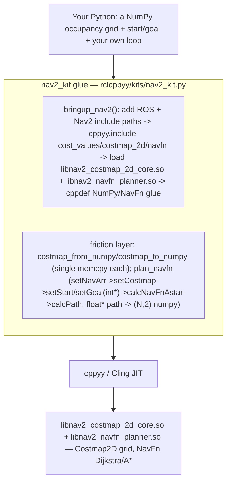

# nav2_kit spike — composing your own Nav stack from Nav2's algorithm cores in Python via cppyy

**Date:** 2026-07-11 · **Env:** pixi `nav2` (robostack-jazzy + conda-forge),
`ros-jazzy-nav2-costmap-2d`, `ros-jazzy-nav2-navfn-planner`,
`ros-jazzy-nav2-smac-planner`, `ros-jazzy-nav2-regulated-pure-pursuit-controller`,
`ros-jazzy-nav2-msgs`, `cppyy 3.5.0`, Python 3.12.13, linux-64.
**Question:** Nav2's Python story is client-side only (`nav2_simple_commander` sends
goals to the C++ lifecycle servers; every algorithm is a C++ class behind
pluginlib). Can we instead build *our own* nav stack by driving Nav2's **algorithm
cores directly** from Python — **no lifecycle servers, no pluginlib, no tf** — with
Python owning the loop and C++ owning the math?

**Verdict: YES for the separable cores. GO.** `nav2_costmap_2d::Costmap2D` (a plain
grid class, no node) and `nav2_navfn_planner::NavFn` (the pure planner algorithm that
operates on a costmap char array, no node) are driven end to end from Python against
the installed Nav2, and composed into a complete miniature nav stack — synthetic
world → costmap → NavFn plan → pure-pursuit follow loop → live `OccupancyGrid` +
`Path` + `TwistStamped` on real ROS 2 topics via rclcppyy. The honest boundary of the
thesis is equally clear and is stated plainly: **Smac (Hybrid-A\*) and the
RegulatedPurePursuit controller are lifecycle-coupled and are NOT usable standalone**
in this release (evidence in §Probe D/F). The controller half of the showcase is
therefore ~30 lines of Python pure-pursuit, and we say so.

(For motivation and a stock-Nav2-vs-ours side-by-side, see [WHY.md](WHY.md); for the
API and copy-paste patterns, see [NAV2_KIT.md](NAV2_KIT.md).)

---

## How the kit works



Bringup locates the install, JIT-includes the cost-value / costmap / navfn headers,
and loads the two `.so` so calls resolve. Nav2's own classes are used **directly** on
the returned `nav2_costmap_2d` / `nav2_navfn_planner` namespaces
(`Costmap2D(...)`, `NavFn(...)`). The friction layer is small and targeted: a
single-`memcpy` NumPy↔charmap bridge (§Probe B), and one helper that wraps NavFn's
real call sequence and its raw-pointer I/O (§Probe C/E).

**The same recipe as bt_kit / pcl_kit / ompl_kit.** Every kit is three moves: **(1)
bringup** — locate the install, `cppyy.include` its headers, `cppyy.load_library` its
`.so`; **(2) hide the cppyy sharp edges** — here, the bulk-buffer memcpy, NavFn's
`int*` start/goal and `float*` path arrays, and the `unsigned char`-as-`str` gotcha;
**(3) mirror the library's own API** so existing Nav2 knowledge transfers 1:1.
nav2_kit is **~88 lines of Python + 38 lines of embedded C++ glue** (281 with
docstrings).

---

## 1. Possible at all? — capability probe matrix

Each capability was probed in isolation from the `nav2` env against the installed
Nav2. Scratch probes and their output are the evidence behind each row.

| # | Capability | Result | Evidence |
|---|---|:--:|---|
| A | **Bringup + JIT**: include cost_values/costmap_2d/navfn headers, load the 2 `.so` | **WORKS** | Warm bringup **~70 ms** (costmap headers ~57 ms dominant — they pull `geometry_msgs`/`nav_msgs`; navfn header ~1 ms; loading both libs ~10 ms). `probe_cppdef` of the C++ glue returns **OK** once given the full ROS include-path set (see §Gotchas). First-ever run rebuilds the cppyy std PCH (~a minute, once/machine). |
| B | **Costmap2D from Python** + bulk NumPy→charmap load | **WORKS** | `Costmap2D(w, h, res, ox, oy, default)` is a plain class (no node); `getCharMap()` exposes the `unsigned char*` grid. A `(H,W)` uint8 array crosses in a **single `std::memcpy`**. See the crossing table below. |
| C | **NavFn plan** on that costmap (no node!) | **WORKS** | `NavFn(nx, ny)` → `setNavArr` → `setCostmap(charmap, isROS=True, allow_unknown)` → `setStart/setGoal(int*)` → `calcNavFnAstar(cancel)` → `calcPath`. Plans a 100×100 world through a doorway in **~8 ms**; 1024×1024 in **~5–23 ms** (§bench). |
| D | **Smac A\* core** (`AStarAlgorithm<Node2D>`) | **BLOCKED** | Two independent couplings (§2). `a_star.hpp` transitively `#include`s `node_hybrid.hpp` → `ompl/base/StateSpace.h`, and **OMPL is not in the nav2 env**, so the header will not even JIT-parse. Even past that, `createPath` needs a `GridCollisionChecker` whose only public ctor is `(shared_ptr<Costmap2DROS>, unsigned, shared_ptr<LifecycleNode>)` — the plain-`Costmap2D*` ctor is **commented out** in `collision_checker.hpp`. |
| E | **getPath extraction** to NumPy | **WORKS** | `getPathLen()` + `getPathX()`/`getPathY()` (`float*`) → one `memcpy` into an `(N,2)` float32 array. Endpoints match the requested start/goal; order is start→goal. |
| F | **RegulatedPurePursuit** | **PARTIAL** | The `RegulatedPurePursuitController` plugin is lifecycle-coupled: `configure()` takes a `LifecycleNode::WeakPtr` and needs path/parameter handlers + `costmap_ros` + tf. But its **header-only regulation math is separable**: `heuristics::curvatureConstraint(v, curvature, min_radius)` (plain doubles) is callable standalone (verified: `0.5 → 0.25` on a turn tighter than the min radius). |

**Two cores separable (Costmap2D, NavFn); Smac blocked; RPP controller blocked but its
core math separable.** This is exactly the honest C/Python split the thesis predicted.

---

## 2. The headline — a pure algorithm core vs a lifecycle-coupled plugin

The whole thesis turns on one distinction, and Nav2 has clean examples of both sides:

**NavFn is a pure algorithm** — `class NavFn { NavFn(int nx, int ny); void
setCostmap(const COSTTYPE* cmap, bool isROS, bool allow_unknown); bool
calcNavFnAstar(std::function<bool()>); int calcPath(int); float* getPathX(); ... }`.
No node, no tf, no pluginlib — it takes a raw `unsigned char*` cost array and hands
back `float*` path arrays. That is *directly* drivable from Python, and the Nav2
`NavfnPlanner` lifecycle node is just a thin ROS wrapper around exactly these calls.
nav2_kit reproduces the wrapper's call sequence in Python.

**Smac's A\* and RPP's controller are lifecycle-coupled.** `GridCollisionChecker`'s
only exposed constructor takes a `Costmap2DROS` (the full costmap *ROS wrapper*, a
lifecycle node) and a `LifecycleNode`; the plain-`Costmap2D*` overload exists in the
source but is `//`-commented in the shipped header. And `a_star.hpp` unconditionally
pulls Hybrid-A\*'s `node_hybrid.hpp`, which needs OMPL headers not present in the env.
`RegulatedPurePursuitController::configure` takes a `LifecycleNode::WeakPtr`. None of
these can be constructed without re-introducing the lifecycle machinery the thesis
sets out to avoid.

**The kit-authoring heuristic this yields:** before committing to "drive the core
from Python", grep the target class's constructor / `configure` signatures for
`LifecycleNode`, `*ROS`, or a pluginlib base. The classes that take **plain data**
(`Costmap2D(w,h,...)`, `NavFn(nx,ny)`, `setCostmap(unsigned char*, ...)`) are the
separable cores; the ones that take a node are not.

---

## 3. The NumPy ↔ costmap crossing (the bulk-data lesson, third instance)

`Costmap2D::getCharMap()` returns the raw `unsigned char*` grid — a plain
`size_x*size_y` byte buffer with the same row-major layout as a `(H,W)` NumPy array.
So loading a grid is a single `std::memcpy` addressed via `uintptr_t` in a `cppdef`
helper — the same pattern as pcl_kit's cloud copy and bt_kit's PortsList. The naive
alternative, a per-cell `costmap.setCost(mx, my, v)` loop from Python, is
~130 ns/cell.

Measured (steady-state, after `warmup()`; shared machine — directional):

| N | cells | bulk `memcpy` | per-cell `setCost` Python loop | speedup |
|---|--:|--:|--:|--:|
| 512 | 262 144 | **~0.05 ms** | ~30.8 ms | **~600×** |
| 1024 | 1 048 576 | **~0.035 ms** | ~125.4 ms | **~3600×** |

(The 256×256 bulk figure is noisy — the first *large* costmap allocation after warmup
still pays a one-time page-fault/alloc cost; the 512/1024 rows are the clean
steady-state memcpy, which is header-size-independent as expected.) `costmap_to_numpy`
is the symmetric `memcpy` out.

---

## 4. Bench — NavFn (C++) vs a pure-Python A\* (the orchestration story)

The same plan on `N×N` **serpentine-maze** worlds (horizontal walls with alternating
gaps, so the straight-line heuristic is badly misled and A\* must expand a large
fraction of the free cells — a *real* search workload; a simple wall+doorway lets the
heuristic walk straight to the goal, which measures nothing). `NavFn` is Nav2's real
C++ planner driven via nav2_kit; `py-A*` is a plain pure-Python 8-connected A\* (NumPy
grid + `heapq`) written in `bench_nav2_plan.py` and labeled as such. **Shared machine
during measurement — directional, not exact.**

| N | cells | NavFn C++ ms | py-A\* ms | py-A\* expansions | NavFn speedup |
|---|--:|--:|--:|--:|--:|
| 256 | 65 536 | ~15 | ~96 | 52 817 | ~6× |
| 512 | 262 144 | ~5.4 | ~435 | 224 370 | **~80×** |
| 1024 | 1 048 576 | ~23 | ~1913 | 915 520 | **~82×** |

They are *different algorithms* (NavFn builds a full Dijkstra/A\* potential field; the
baseline is goal-directed A\*), so this is an order-of-magnitude story, not an
apples-to-apples race: keeping the search loop in Python costs ~1.9 s on a 1024²
grid, while handing the grid to the compiled core stays in the tens of milliseconds.
The 256 row is dominated by NavFn first-use residue on the shared machine; the 512/1024
rows are the clean signal. Run it: `pixi run -e nav2 bench-nav2-plan`.

---

## 5. The showcase — a complete miniature nav stack in one file

`scripts/nav2_kit_demos/d02_own_nav_stack.py` (`pixi run -e nav2 demo-nav2-stack`) is
the thesis made concrete:

- **World → costmap → plan (C++):** a 120×120 "two rooms + doorway + box obstacle"
  world → `Costmap2D` → `NavFn` plan (166 waypoints, through the doorway around the
  box).
- **Follow loop (Python, honest split):** a ~30-line pure-pursuit controller +
  simulated diff-drive kinematics. Pure-pursuit is Python because Nav2's RPP
  controller is lifecycle-coupled (§Probe F) — stated in the file.
- **Publish via rclcppyy:** real C++ `nav_msgs/OccupancyGrid`, `nav_msgs/Path`, and
  `geometry_msgs/TwistStamped` messages on live ROS 2 topics
  (`/nav2_kit/{map,plan,cmd_vel}`), so an rviz2 with Fixed Frame `map` shows the map,
  plan, and commanded velocity live. **Verified:** all three topics advertised and
  publishing during a run; `GOAL REACHED` in ~142 steps (~7 s sim).

Sample output (start `(0.93, 3.03)` → goal `(5.03, 1.78)`):
```
Planned 166 waypoints (0.925, 3.025) -> (5.025, 1.775) (NavFn, C++).
STEP    0 pose=(0.94,3.01, -40.5 deg) cell=(18, 60) cmd=(v=0.54,w=+1.55) dist_to_goal=4.29
STEP   70 pose=(2.97,2.60, -18.3 deg) cell=(59, 51) cmd=(v=0.60,w=-0.42) dist_to_goal=2.24
STEP  140 pose=(4.91,1.80, -13.8 deg) cell=(98, 35) cmd=(v=0.60,w=+0.64) dist_to_goal=0.15
GOAL REACHED at (4.94,1.79) in 142 steps (~7.1s sim).
```

---

## 6. GAPS — what this is NOT, and what an LLM-agent user hits next

**This is the algorithm-core road, not a Nav2 stack.** Explicitly absent:

1. **No lifecycle servers.** No `planner_server`/`controller_server`/`bt_navigator`,
   no lifecycle transitions, no parameter YAML, no action interface.
2. **No pluginlib.** Planners/controllers/costmap layers are not loaded as plugins;
   you call the concrete C++ class.
3. **No tf.** All coordinates are grid cells / a single fixed `map` frame; there is no
   `map→odom→base_link` transform tree, no localization.
4. **No dynamic costmap layers.** No `StaticLayer`/`ObstacleLayer`/`InflationLayer`/
   `VoxelLayer` pipeline, no sensor `observation_buffer`, no rolling window. The
   costmap is a static grid you fill; inflation, if wanted, is your own (or a future
   `InflationLayer`-core probe).
5. **No recovery behaviors / behavior trees** (that is bt_kit's territory).
6. **Smac (Hybrid-A\*, Lattice) is not surfaced** — blocked on OMPL headers + a
   lifecycle-coupled collision checker (§Probe D). A Smac spike would need the OMPL
   headers on the path and a way past `GridCollisionChecker`'s node requirement.
7. **RegulatedPurePursuit controller is not surfaced** — lifecycle-coupled; only its
   header-only regulation math is reachable (§Probe F).
8. **NavFn only.** Other global planners (Theta\*, etc.) and the costmap's own
   `setConvexPolygonCost`/`convexFillCells` rasterizers are one `cppyy.include`/call
   away but not wrapped.
9. **The other direction is a separate planned spike.** Putting a **Python planner /
   controller plugin *inside* a real Nav2 server** (via a pluginlib bridge, à la the
   `control_kit` idea) is the complementary capability and is explicitly *not* this
   spike — this is "our own stack from the cores out", not "Python inside Nav2".

---

## 7. Generic lessons for cppyy_kit (candidates for COMMON_PATTERNS)

These generalized beyond Nav2. **Noted here for the lead — COMMON_PATTERNS.md was being
edited in parallel, so this report does not touch it.**

- **NEW: `unsigned char` crosses cppyy as a 1-char Python `str`, not an int.**
  `Costmap2D::getCost()` and the `static constexpr unsigned char` cost constants
  (`LETHAL_OBSTACLE` = 254, …) come back as length-1 strings — `'\xfe' == 254` is
  `False`, a silent trap in any comparison/threshold. Read a single cell with
  `ord(costmap.getCost(mx, my))`, and a kit should expose **plain-int** constants
  (nav2_kit does). This is the mirror image of §11 ("enums compare equal to ints") —
  worth its own sentence.
- **A failed `cppyy.include` contaminates the interpreter, not just a failed
  `cppdef` (extend §9).** When Smac's `a_star.hpp` failed mid-parse (missing OMPL
  transitive header), the *next, unrelated* `cppyy.include` of the RPP header also
  failed spuriously (a `std::common_type<double>` chrono error) in the same process —
  but that RPP header includes **cleanly in a fresh process**. Lesson: probe a *risky
  include* (one with heavy/uncertain transitive deps) out-of-process / in isolation,
  exactly as `probe_cppdef` does for `cppdef`. §9 currently frames this only around
  `cppdef`.
- **`probe_cppdef` must be given the *same* include-path set as the in-process
  bringup.** A header that transitively pulls the ROS message tree
  (`costmap_2d.hpp` → `geometry_msgs`/`nav_msgs`) makes the out-of-process probe fail
  on a *missing transitive header* (a false negative) unless every ament include dir
  is passed — not just the target library's. Worth a sentence in the §9
  `probe_cppdef` note (collect them via `get_packages_with_prefixes`).
- **Third instance of the bulk-buffer memcpy lesson (§6).** After bt's parallel
  `vector<string>` and pcl's point-cloud memcpy, Nav2's `unsigned char*` costmap is a
  third confirmation: expose the raw buffer address as `uintptr_t`, `memcpy` in a
  `cppdef` helper, ~600–3600× a per-element Python loop.
- **Output-by-pointer-array is another "keep it in C++" case (§6).** NavFn's
  `setStart/setGoal(int*)` and `getPathX()/getPathY()` (`float*` + separate length)
  are cleanest wrapped in one `cppdef` helper that takes ints and `memcpy`s the output
  arrays, rather than marshalling C arrays across the boundary from Python.
- **Kit-authoring heuristic: grep ctor/`configure` signatures for lifecycle coupling
  first (§2).** "Drivable core" vs "needs a node" is decided by whether the class
  takes plain data or a `LifecycleNode`/`*ROS`/pluginlib base. A one-line `nm -DC` /
  header grep up front tells you which targets are separable before you invest.

---

## 8. Recommendation — GO

The hypothesis holds for the cores that are genuinely separable: **Nav2's Costmap2D
and NavFn are driven end to end from Python against the installed Nav2, with no
lifecycle servers, no pluginlib, and no tf**, and composed into a working miniature
nav stack that plans in C++, follows in Python, and publishes to rviz-consumable ROS 2
topics — the "compose your own nav stack via Python" ask, delivered. The boundary is
drawn honestly and backed by evidence: Smac and the RPP *controller* are
lifecycle-coupled and out of scope for this road (their core math, where separable, is
noted), and the *reverse* direction — Python plugins inside real Nav2 servers — is a
separate planned spike. nav2_kit is a thin mirror (~88 Python + 38 C++ glue lines)
because, once again, cppyy absorbs the hard parts and the kit only removes the
library's specific friction.

**Next investments, in priority order:** (a) a costmap **InflationLayer**-core probe
(inflate obstacles from Python, closing the biggest realism gap); (b) `Costmap2D`'s
polygon rasterizers (`setConvexPolygonCost`) for footprint/obstacle authoring; (c) a
Smac spike with OMPL headers on the path + a route past `GridCollisionChecker`'s node
requirement; (d) surface another global planner (Theta\*) to show breadth; (e) the
complementary **pluginlib-bridge** spike (Python planner/controller *inside* a real
Nav2 server).
