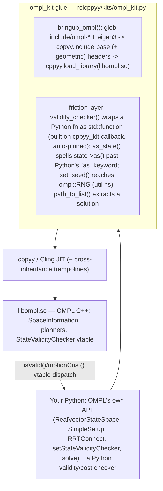

# ompl_kit spike — driving the Open Motion Planning Library from Python via cppyy

**Date:** 2026-07-11 · **Env:** pixi `ompl` (robostack-jazzy + conda-forge),
`ros-jazzy-ompl 1.7.0`, `eigen 3`, `cppyy 3.5.0`, Python 3.12.13, linux-64.
**Question:** can OMPL — whose official Python bindings are a notoriously painful
Py++ codegen build (multi-hour, ~6 GB RAM, lagging releases) — be driven from
Python via cppyy against the installed 1.7.0, *and* can a Python class derive an
OMPL C++ virtual base (cross-language inheritance), with the C++ planner calling
the Python override in its hot loop?

**Verdict: YES. GO.** All five probes passed, including the headline: **a Python
class deriving `ompl::base::StateValidityChecker` and overriding `isValid` is
called by the C++ planner** — 170 times in a trivial RRTConnect solve, and a Python
`OptimizationObjective::motionCost` was called **1,034,069 times** in a single 1 s
RRTstar solve (~1M Python virtual dispatches/second). This is the **first kit in
the stack to use cppyy cross-inheritance** — BT.CPP blocked it with `final`
virtuals; OMPL's are plain virtuals, so it works. The honest cost: a Python
validity check is ~**159x** slower per call than native C++ (~282 ns vs ~1.8 ns),
which is invisible for a trivial plan but real when validity dominates — so the kit
documents the *lowering* path (prototype in Python, lower the hot checker to a
JIT'd C++ one).

(For motivation and a C++-vs-Python side-by-side, see [WHY.md](WHY.md); for the API
and copy-paste patterns, see [OMPL_KIT.md](OMPL_KIT.md).)

---

## How the kit works



Bringup locates the install, JIT-includes the base headers (state spaces, validity
checker, optimization objective) and the geometric planners, and loads `libompl.so`
so calls resolve. OMPL's own API is used **directly** on the returned `ob` / `og`
namespaces — the kit wraps nothing that already works. Its friction layer is small
because cppyy handles the hard parts (inheritance, ownership, downcast) so well: it
adds only `validity_checker` (the `std::function` overload, signature fixed +
lifetime pinned), `as_state` (the unspellable `as<T>()` idiom), `set_seed` (RNG
lives in a non-obvious namespace), and `path_to_list` (result extraction).

**The same recipe as bt_kit / pcl_kit.** Every kit is three ingredients: **(1)
bringup** — locate the install, `cppyy.include` its headers, `cppyy.load_library`
its `.so`; **(2) hide the cppyy sharp edges** for that library — here, the pointer
signature of the validity `std::function`, the `as` keyword clash, RNG-namespace
discovery, and the cross-inheritance lifetime pin; **(3) mirror the library's own
API** so existing OMPL knowledge (and an LLM's) transfers 1:1. ompl_kit is **72
lines of Python code** (228 with docstrings) and **zero embedded C++** — the
thinnest kit yet, because cppyy does more of the work.

---

## 1. Possible at all? — capability probe matrix

Each capability was probed in isolation from the `ompl` env against the installed
OMPL 1.7.0. Scratch probes and their output are the evidence behind each row.

| # | Capability | Result | Evidence |
|---|---|:--:|---|
| 1 | **Bringup + JIT**: include base + geometric headers, load `libompl.so` | **WORKS** | Warm bringup **~538 ms** (base 478 ms + geometric 61 ms); `SpaceInformation.h` dominates (~424 ms, the boost-heavy header), everything else <90 ms; idempotent re-call ~0 ms. Cheaper than pcl (~1.3 s) and bt (~0.9 s) despite the boost. First-ever run rebuilds the cppyy PCH (~a minute), once per machine. |
| 2 | **Pure-Python plan** via `SimpleSetup` + `RRTConnect`, `std::function` validity fn | **WORKS** | `RealVectorStateSpace(2)`, bounds, always-true checker: **exact** solution in 113 validity calls, path length 1.4142 (unit-square diagonal). Entirely from Python. |
| 3 | **Cross-inheritance** (THE headline): Python class derives `ob.StateValidityChecker`, overrides `isValid(const State*)` | **WORKS** | The C++ RRTConnect called the Python `isValid` **170 times**; the plan routes around a circular obstacle (length 1.46 > the 1.41 straight diagonal). See §2 for exact mechanics. |
| 4 | **callback() path**: the `std::function<bool(const State*)>` overload via `cppyy_kit.callback` | **WORKS** | Solves with 139 validity calls. Requires an **explicit** signature — inference maps the `State` annotation to `State&`, not the `const State*` OMPL wants (see §4). |
| 5 | **OptimizationObjective subclass** driving RRTstar (stretch) | **WORKS** | Python `motionCost` override called **1,034,069 times** in a 1 s RRTstar solve, converging to the optimal 1.4143. ~1M Python virtual dispatches/second, sustained. |

**Zero hard failures.** One "worked but sharp" edge (§4's callback inference) is a
one-line fix already baked into the kit.

### Fragility notes (things that worked but felt sharp)
- **The validity `std::function` is a `const State*` (pointer), not a reference.**
  `cppyy_kit.callback`'s type-hint inference maps a cppyy class annotation to a
  *reference* (`State&`), so `callback(fn)` on a hinted `fn` silently produces
  `std::function<bool(State&)>` — a valid wrapper that will **not bind** to
  `setStateValidityChecker` (the mismatch surfaces at the setter, not at
  `callback()`). Fix: pass `signature="bool(const ompl::base::State*)"` explicitly;
  the kit's `validity_checker` bakes that in so users never hit it.
- **Cross-inheritance lifetime.** cppyy does **not** keep the Python checker/
  objective alive just because C++ holds its `shared_ptr` — the same "callable was
  deleted" footgun as raw callbacks. We hit it for real (probe 5, a throwaway
  inline `lambda` validity fn collected before `solve()`). Pin the Python instance
  (`cppyy_kit.keep_alive(ss, checker)` / `validity_checker(..., owner=ss)`).
- **`state->as<T>()` is unspellable in Python** — `state.as[...]` is a `SyntaxError`
  (`as` is a keyword). `ompl_kit.as_state(state, T)` does `getattr(state,"as")[T]()`.
  Usually you don't need it: cppyy **auto-downcasts** the `const State*` a planner
  hands the checker (RTTI), so `state[0]`/`state[1]` work directly for a
  `RealVectorStateSpace`.
- **`ompl::RNG` lives in the util namespace, not `base`**, and OMPL warns + ignores
  a seed set *after* the first sample. So reproducible runs must seed before the
  first solve and, because the global RNG can't be re-seeded mid-process, run each
  seeded solve in a **fresh process** (the bench does exactly this).
- **`shared_ptr` ownership transfers cleanly.** Wrapping a cppyy-owned raw space/
  planner in the library's `Ptr` (`ob.StateSpacePtr(space)`) flips the proxy's
  `__python_owns__` from `True` to `False` — cppyy hands ownership to the
  `shared_ptr`, so there is **no double-free** (verified: clean exit code 0). The
  wrap idiom is safe and reads like the C++ tutorial's `make_shared`.

---

## 2. The headline — cross-language inheritance mechanics

OMPL's official bindings expose subclassing via Py++-generated trampolines. cppyy
gives it for free, at runtime, against the installed library — **provided the C++
virtual is not `final`** (BT.CPP's `tick()`/`halt()` are `final`, which is exactly
why bt_kit had to route stateful nodes through a C++ shim instead). OMPL's
`isValid`, `stateCost`, `motionCost` are plain virtuals, so a Python subclass just
works. What it takes, exactly:

```python
class CircleChecker(ob.StateValidityChecker):
    def __init__(self, si):
        super().__init__(si)          # (1) REQUIRED: chain to the C++ base ctor
        self.calls = 0
    def isValid(self, state):          # (2) override by the EXACT C++ virtual name
        self.calls += 1
        return (state[0]-0.5)**2 + (state[1]-0.5)**2 > 0.25**2   # (3) state auto-downcast

checker = CircleChecker(ss.getSpaceInformation())
cppyy_kit.keep_alive(ss, checker)      # (4) PIN it — C++ holding the ptr won't
ss.setStateValidityChecker(ob.StateValidityCheckerPtr(checker))   # (5) wrap in the shared_ptr
```

1. **Constructor chaining is required.** `super().__init__(si)` runs the C++ base
   constructor (`StateValidityChecker(const SpaceInformationPtr&)`); without it the
   C++ subobject is not constructed and the object is unusable. `si` is whatever the
   base wants — here the `SpaceInformationPtr` from `ss.getSpaceInformation()`.
2. **The override must match the C++ virtual's exact name/shape** (`isValid`, not
   `is_valid`). cppyy builds a trampoline whose vtable slot calls the Python method.
3. **The `const State*` argument is auto-downcast** by cppyy via RTTI to its runtime
   type (`RealVectorStateSpace::StateType`), so `state[i]` reads coordinates with no
   explicit cast. (For compound spaces use `ompl_kit.as_state`.)
4. **Lifetime must be pinned.** C++ holding the `shared_ptr` does not keep the Python
   object alive; pin it (`keep_alive`) or it is collected and the next dispatch
   raises `TypeError: callable was deleted`.
5. **Hand it to C++ through the library's `shared_ptr` wrapper**
   (`ob.StateValidityCheckerPtr(checker)`). Ownership transfer applies here too.

**GIL / threading:** the override runs in whichever C++ thread invokes it, holding
the GIL. A single `solve()` is single-threaded, so there is no contention; a
multi-threaded planner (e.g. OMPL's `pRRT`) ticking a Python checker would serialize
on the GIL — keep Python checkers on single-threaded planners, or lower to C++.

**Cost:** see §3. A Python override is ~150–190x slower per call than a native C++
one, but sustains ~1–3M dispatches/second — enough that probe 5's million-call
RRTstar solve ran in ~1 s.

---

## 3. Bench — Python validity in a REAL hot loop (the honest number)

The same 2D plan (unit square, circular obstacle, RRTConnect, fixed seed so all
three explore *identical* geometry), three ways to answer "is this state valid?":

- **(a) callback** — a Python fn via `ompl_kit.validity_checker`
  (`std::function<bool(const State*)>` wrapping Python);
- **(b) cross-inherit** — a Python class deriving `ob.StateValidityChecker`;
- **(c) cpp** — a native C++ `StateValidityChecker`, JIT-compiled once (the
  "lowered" checker; the call never leaves C++).

Each variant runs in a **fresh subprocess** (OMPL's global RNG can only be seeded
once/process). `solve ms` + validity-call count come from the real solve; `ns/call`
+ `calls/s` come from a microbenchmark (N=2M direct `isValid` calls from a C++
driver loop) that isolates the pure Python↔C++ boundary. **Shared machine during
measurement — provisional, directional not exact.**

| validity variant | solve ms | valid calls | path len | ns/call\* | calls/s\* |
|---|--:|--:|--:|--:|--:|
| **(a) Python fn via callback()** | 9.30 | 136 | 1.4391 | **282** | 3.54 M |
| **(b) Python subclass (cross-inherit)** | 10.05 | 136 | 1.4391 | **345** | 2.90 M |
| **(c) native C++ (JIT'd, lowered)** | 9.32 | n/a | 1.4391 | **1.8** | 564 M |

\* microbenchmark: N direct `isValid` calls from a C++ driver loop — the pure
boundary cost. `solve ms` includes *all* planner overhead, not just validity.

**Reading these numbers honestly:**
- **Python in the loop is ~159x slower per call** (282 ns callback / 345 ns
  cross-inherit vs 1.8 ns native). Cross-inheritance is a touch slower than the
  `std::function` callback (extra vtable hop), but they are the same order.
- **For a trivial plan it does not matter.** At 136 validity calls the Python
  boundary costs ~40 µs — lost in the ~9–10 ms of planner overhead (nearest-neighbor
  queries, interpolation, tree bookkeeping). All three solve in the same ~9 ms.
- **It bites when validity/cost dominates.** Probe 5's RRTstar made **1.03M**
  Python `motionCost` calls in one solve — at ~345 ns that is ~0.35 s of pure
  boundary overhead. This is the honest "Python in a real hot loop" figure the
  other kits couldn't measure (BT ticks and PCL filters don't call back per inner
  iteration; OMPL validity does).
- **The answer is lowering, not spin.** Prototype the checker in Python (variants
  a/b) for fast iteration; when a planner calls it millions of times, lower that one
  checker to a JIT'd C++ `StateValidityChecker` (variant c) — same OMPL calls, same
  structure, 150x faster inner loop. cppyy makes both the prototype *and* the lowered
  version reachable from the same script (the native checker is a ~6-line
  `cppyy.cppdef`).

Run it: `pixi run -e ompl bench-ompl`.

---

## 4. callback() dogfood feedback

`cppyy_kit.callback` (the one-line Python→C++ callback with inferred signature +
auto-pin) was exercised on OMPL's `std::function<bool(const State*)>` validity slot
— a real-world `std::function` sink, exactly the intended use.

**What worked well.** Auto-pinning is the hero: the "callable was deleted" footgun
is real here (a raw inline `lambda` validity fn *was* collected before `solve()` in
probe 5), and `callback(owner=ss)` made it impossible. `validity_checker` is a
one-liner on top of it. The C++→Python direction (a JIT'd C++ checker handed back
into `setStateValidityChecker`) needed no helper, as documented.

**The one friction: inference can't produce a const-pointer signature.** OMPL's
callback typedef is `bool(const State*)` — a pointer. `callback`'s type-hint
inference maps a cppyy class annotation to a *reference* (`Class&`), so a hinted
`def fn(state: ob.State) -> bool` infers `std::function<bool(ompl::base::State&)>`.
That is a *valid* wrapper — `callback()` does not error — but it is the wrong type
for `setStateValidityChecker`, and the mismatch only surfaces (as an overload
resolution failure) at the setter, one call later. This is the "explicit wins" case
the cppyy_kit docs already flag for pointer/const forms; the observation for the
lead is that **for a library whose callback typedef is pointer-based, inference
succeeds with a silently non-binding form** — no code change needed (the kit wraps
the explicit signature once in `validity_checker`), but it is worth a sentence in
COMMON_PATTERNS §3 that "inferred reference vs required pointer" is a real, quiet
mismatch, not a hypothetical.

---

## 5. GAPS — what an LLM-agent user hits next

1. **One Python call per state — no batching.** Every validity/cost query crosses
   the boundary individually. A *vectorized* checker (test many sampled states in
   one crossing, e.g. via a NumPy array of coordinates) would amortize the ~300 ns
   and is the obvious next optimization for Python-in-the-loop planning.
2. **State access is per-space.** `RealVectorStateSpace` auto-downcasts to
   `state[i]`; compound spaces (SE2/SE3) need `ompl_kit.as_state` + `getX/getY/getYaw`
   (works, shown in the tests, but you must know the concrete `StateType`).
3. **Only RRTConnect / RRTstar headers are pre-included.** Any other planner
   (`PRM`, `RRTsharp`, `BITstar`, ...) is one `cppyy.include` away — the kit
   deliberately doesn't pre-parse the whole planner zoo.
4. **Geometric only.** `ompl::control` (kinodynamic planning, `ODESolver`,
   `StatePropagator`) is reachable via cppyy but not surfaced or probed here.
5. **In-process RNG re-seeding is unreliable.** OMPL's global `RNG` ignores a seed
   after the first sample, so reproducible planning needs a fresh process per seed
   (the bench does this; a single script solving once is fine).
6. **Cross-inheritance lifetime is manual.** You must `keep_alive` the Python
   checker/objective; the kit does it for `validity_checker(owner=)` but a raw
   subclass instance is the user's to pin.
7. **`path_to_list` needs the dimension** (the `PathGeometric` doesn't carry it) and
   models only real-vector coordinates; compound-space waypoints are read via
   `as_state`.
8. **First-run PCH rebuild** (~a minute, once per machine) — the cppyy std PCH, not
   per process.

---

## 6. Generic lessons for cppyy_kit (candidates for COMMON_PATTERNS)

These generalized beyond OMPL. **Noted here for the lead — COMMON_PATTERNS.md is
being edited in parallel, so this report does not touch it.**

- **NEW: cross-language inheritance (Python derives a C++ virtual base).** The first
  kit to use it. Mechanics (§2): derive the cppyy class; `super().__init__(base
  args)` is **required**; override the virtual by its **exact C++ name**; hand the
  instance to C++ through the library's `shared_ptr` wrapper; **pin the Python
  instance** (`keep_alive`) — the "callable was deleted" footgun applies to
  subclass instances too. **Only works on plain virtuals** — a `final` (or
  non-virtual) member cannot be overridden across the boundary (bt_kit's `final`
  `tick()` is the counter-example; it needed a C++ shim). Cost: ~350 ns/call,
  1–3M dispatches/s.
- **`shared_ptr` ownership transfer on wrap.** Constructing a library `Ptr` from a
  cppyy-owned raw flips `__python_owns__` to `False` — cppyy yields ownership to the
  `shared_ptr`, so no double-free. Makes the "wrap the raw" idiom safe and mirrors
  `make_shared`.
- **RTTI auto-downcast of pointer arguments.** cppyy presents a base-typed pointer
  argument (a callback's `const State*`) as its concrete runtime type, so member
  access works without an explicit downcast. Removes most of the need for a cast
  helper.
- **The `as` keyword collision.** The pervasive C++ idiom `obj->as<T>()` is a Python
  `SyntaxError`; `getattr(obj, "as")[T]()` is the spelling. A one-liner, but a
  guaranteed stumble for any library that names a method `as`.
- **callback() inferred-reference vs required-pointer** (§4): confirmed on a real
  library that inference can succeed with a form that silently won't bind. Wrapping
  the explicit signature once in a kit helper is the fix.

---

## 7. Recommendation — GO

The hypothesis is **proven twice over**: (1) OMPL's official geometric-planning
workflow runs from Python with OMPL's own API verbatim, against the installed 1.7.0,
with **no Py++ codegen build** — the "impossible → possible" bar the other kits
also clear; and (2) the harder, novel claim — **cross-language inheritance** — holds:
a Python class deriving an OMPL C++ virtual base is called by the C++ planner in its
hot loop, thousands to millions of times per solve. That is the capability OMPL's
own bindings make you rebuild for hours to get, available here at runtime.

The honest cost is stated plainly: Python-in-the-loop validity is ~159x slower per
call than native C++, invisible for small plans and material when validity
dominates — and cppyy uniquely lets you **lower** the one hot checker to C++ in the
same script when it does. The gaps are about *breadth* (batched validity, more
planners, control-space, compound-state ergonomics) not *feasibility*. ompl_kit is
the thinnest kit yet (72 LOC, zero embedded C++) precisely because cppyy absorbs the
inheritance, ownership, and downcast work — a strong signal the playbook generalizes.

**Next investments, in priority order:** (a) a vectorized/batched validity checker
to amortize the boundary; (b) compound-state helpers (SE2/SE3 read/write); (c)
surface a couple more planners (PRM, BIT\*) with their headers; (d) a control-space
(kinodynamic) probe; (e) a one-call "lower this Python checker to C++" helper that
emits the `StateValidityChecker` subclass from a template.
