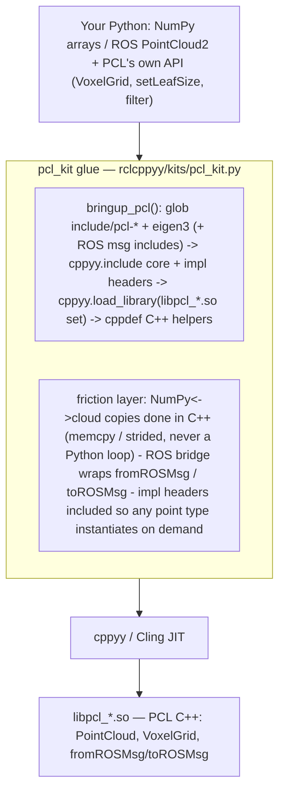

# pcl_kit spike — driving the Point Cloud Library from Python via cppyy

**Date:** 2026-07-11 · **Env:** pixi `pcl` (robostack-jazzy + conda-forge),
`pcl 1.15`, `ros-jazzy-pcl-conversions`, `eigen 3`, `cppyy 3.5.0`, Python 3.12.13,
linux-64. **Question:** can the official PCL C++ workflow (VoxelGrid and friends)
be driven from Python — with NumPy arrays and ROS 2 `PointCloud2` messages flowing
in and out — with minimal glue and no code generation, given PCL has no maintained
Python binding?

**Verdict: YES. GO.** Every probe passed, including the two hardest (the
zero-Python-touch ROS money path and a fully custom point type). The kit mirrors
PCL's C++ API 1:1 and only removes cppyy friction. In the headline pipeline
benchmark, pcl_kit is **~15x lower latency and ~9x less CPU** than the honest
rclpy+NumPy baseline — in **essentially the same number of user lines of code**.

(For the motivation and a C++-vs-Python side-by-side, see [WHY.md](WHY.md); for the
API and copy-paste patterns, see [PCL_KIT.md](PCL_KIT.md).)

---

## How the kit works

Bringup locates the install, JIT-includes the core **and template-impl** headers
(so `PointCloud<T>` / `VoxelGrid<T>` / `PCLBase<T>` instantiate for *any* point
type, not just precompiled ones), and loads the `libpcl_*.so` set so calls
resolve. The friction layer keeps every NumPy<->cloud byte copy on the **C++**
side (a Python per-point loop is ~90x slower and building the aligned storage from
Python risks a cppyy SIGSEGV), and wraps `fromROSMsg`/`toROSMsg` so a C++
`sensor_msgs::msg::PointCloud2` round-trips with no Python-side per-point touch.
PCL's own API is used **directly** on the returned namespace — the kit wraps
nothing that already works.

**The same recipe as bt_kit.** Every kit is three ingredients: **(1) bringup** —
locate the install, `cppyy.include` its headers, `cppyy.load_library` its `.so`;
**(2) hide the cppyy sharp edges** for that library — here, keep buffer copies in
C++, include impl headers for on-demand templates, spell custom-type alignment as
`alignas(16)`; **(3) mirror the library's own API** so existing PCL knowledge (and
an LLM's) transfers 1:1. pcl_kit is ~136 lines of code (~100 Python + a ~36-line
embedded C++ helper).

---

## 1. Possible at all? — capability probe matrix

Each capability was probed in isolation from the `pcl` env against the installed
PCL 1.15 headers/libraries. Scratch probes and their output are the evidence
behind each row.

| # | Capability | Result | Evidence |
|---|---|:--:|---|
| 1 | **Bringup + JIT**: include `point_types.h` / `point_cloud.h` / `filters/voxel_grid.h`, load the `libpcl_*.so` set | **WORKS** | Warm JIT **~1.3 s** (point_types 0.91 s + point_cloud 0.10 s + voxel_grid 0.27 s); lib loads negligible. First-ever run rebuilds the cppyy PCH ("~a minute"), once per machine. |
| 2 | **On-demand template instantiation** from pure Python (no cppdef kernel): construct `PointCloud<T>`, `VoxelGrid<T>`, set params, `filter` | **WORKS** | 20-pt cloud -> 1 voxel at 0.05 m leaf, for `PointXYZ` **and** for `PointXYZINormal` / `PointWithViewpoint` — point types the old python-pcl binding never shipped. `push_back` from Python did not segfault. |
| 3 | **NumPy <-> cloud** with honest copy accounting | **WORKS** | See section 3. One C++ copy each way; `(N,4)` in is a single `memcpy` (**0.49 ms** @100k), out-copy **0.35 ms**, zero-copy view **~0.1 ms**. Roundtrip exact (max abs err 0.0). |
| 4 | **ROS money path**: `fromROSMsg`/`toROSMsg` on a C++ `sensor_msgs::msg::PointCloud2`, no Python per-point touch | **WORKS** | Full `fromROSMsg -> VoxelGrid -> toROSMsg` **4.32 ms/frame** @100k in isolation (**~2.5 ms** steady-state inside the live d02 pipeline). `toROSMsg`/`fromROSMsg` are callable **directly from Python** (cppyy deduces `PointT` from the cloud arg) — no C++ helper needed. |
| 5 | **Custom point type** via `cppdef` + `POINT_CLOUD_REGISTER_POINT_STRUCT`, with a filter over it | **WORKS (2 caveats)** | A brand-new `struct MyLidarPoint { PCL_ADD_POINT4D; float intensity; uint16_t ring; }` registered and `VoxelGrid`-filtered (50 pts -> 2 voxels). Caveats below. |

**Zero hard failures.** Probe 5's two caveats are both one-line fixes, documented.

### Fragility notes (things that worked but felt sharp)
- **Cling rejects the trailing `} EIGEN_ALIGN16;` attribute macro** — the standard
  PCL custom-point idiom. It parse-errors (`expected ';' after struct`) and, in a
  larger `cppdef`, the *transaction revert* can SIGSEGV the process with no Python
  traceback. **Fix:** spell it `struct alignas(16) MyPoint { ... };` (attribute
  prefix). Reliable.
- **A novel point type needs the template *impl* headers** so Cling instantiates
  `PCLBase<T>` / `VoxelGrid<T>` in-place — precompiled `.so`s only carry the stock
  types. Without `pcl/impl/pcl_base.hpp` and `pcl/filters/impl/voxel_grid.hpp` you
  get `IncrementalExecutor ... symbol ... unresolved`. The kit includes both at
  bringup, so custom types work out of the box.
- **The NumPy->cloud copy must live in C++.** A Python `push_back` loop over 100k
  points is **~45.7 ms** vs **~0.5 ms** for the C++ memcpy (~90x). Building the
  aligned point vector from Python is also a documented cppyy segfault risk. The
  kit does every byte copy in a `cppdef` helper, addressed via `uintptr_t`.
- **`rclcpp::Time` has no `to_msg()`** (it is the C++ type, not rclpy's) — a stamp
  set via `node.get_clock().now().to_msg()` throws. Set stamps in C++ or leave
  them; d02 does not need them (it measures processing latency).

---

## 2. API design — thin C++-mirror (shipped)

The v0 surface returns the real `pcl` namespace and you use PCL's own names on it:
`pcl.PointCloud[pcl.PointXYZ]`, `pcl.VoxelGrid[pcl.PointXYZ]`, `setInputCloud`,
`setLeafSize`, `filter` — exactly the C++ tutorial. The kit adds only what cppyy
makes awkward:

| Kit surface | Why it exists (the friction removed) |
|---|---|
| `bringup_pcl(with_ros=True)` | Idempotent. Include paths + core/impl headers + `libpcl_*.so` loads + `cppdef` glue. `with_ros=False` skips the ~1.9 s pcl_conversions JIT for NumPy-only work. |
| `cloud_from_numpy(array)` | `(N,3)`/`(N,4)` float array -> `PointCloud<PointXYZ>` in **one C++ copy** (memcpy for `(N,4)`, strided for `(N,3)`). |
| `cloud_to_numpy(cloud, copy=True)` | Cloud -> `(N,3)` float32. `copy=True` is a safe strided copy; `copy=False` is a near-free zero-copy view that aliases PCL storage. |
| `cloud_from_msg(msg, point_type=None)` | `sensor_msgs::msg::PointCloud2` -> `PointCloud<T>` via `fromROSMsg`, no Python per-point touch. `point_type` defaults to `PointXYZ`. |
| `msg_from_cloud(cloud, msg=None)` | `PointCloud<T>` -> `PointCloud2` via `toROSMsg`. |

Everything else (filters, KdTree, segmentation, ...) is reached directly through
the returned namespace — the kit deliberately wraps none of it.

---

## 3. NumPy / ROS bridge — copy accounting (measured, N=100 000, float32)

`pcl::PointXYZ` is a **16-byte** aligned struct (`x,y,z` at offsets 0/4/8, 4 bytes
padding). So an `(N,4)` float32 array maps **1:1** to point storage (single
`memcpy`); an `(N,3)` array needs a strided per-point copy that skips the padding
lane. **True zero-copy *in* is impossible** — NumPy owns its buffer, PCL owns
aligned storage — so the honest floor is *one* copy. Zero-copy *out* is possible
as a view, with a lifetime caveat.

| Direction | Path | What copies where | Cost @100k |
|---|---|---|--:|
| NumPy -> cloud | `(N,4)` memcpy | one `std::memcpy`, NumPy buffer -> PCL aligned storage | **0.49 ms** |
| NumPy -> cloud | `(N,3)` strided | one strided C++ loop (drops padding lane) | **0.70 ms** |
| NumPy -> cloud | Python `push_back` loop *(anti-pattern)* | per-point Python->C++ crossing | 45.7 ms |
| cloud -> NumPy | `copy=True` strided | one strided C++ loop -> private `(N,3)` buffer | **0.35 ms** |
| cloud -> NumPy | `copy=False` view | **no copy** — `(N,4)` view aliases PCL storage (must keep cloud alive) | ~0.11 ms |
| ROS <-> cloud | `fromROSMsg`->`VoxelGrid`->`toROSMsg` | all in C++, zero Python per-point touch | **4.32 ms/frame** |

Roundtrip (`cloud_from_numpy` -> `cloud_to_numpy`) is bit-exact (max abs err 0.0).
**Takeaway:** the honest result is "one memcpy in C++, ~0.5 ms" — vastly better
than any Python-loop conversion, and the ROS path never materializes points in
Python at all.

---

## 4. Showcase benchmark — pcl_kit pipeline (d02) vs rclpy+NumPy baseline (d03)

Identical work on both sides: a synthetic 100k-point `PointCloud2` published at
**10 Hz**, a **0.05 m VoxelGrid**, republished. d02 keeps every cloud in C++
(`fromROSMsg` -> PCL VoxelGrid -> `toROSMsg`); d03 is the honest hand-written
alternative (`read_points_numpy` -> NumPy centroid-per-voxel -> `create_cloud_xyz32`).
Both emit an identical 8000-point result. CPU sampled with psutil (self+children,
steady-state only), same methodology as `scripts/benchmarks/run_benchmarks.py`.
**Shared machine during measurement — treat as provisional, directional not exact.**

| Variant | avg lat | p99 lat | CPU% @10 Hz | max msgs/s* | user LOC |
|---|--:|--:|--:|--:|--:|
| **pcl_kit (C++ end-to-end)** | **3.8 ms** | 8.7 ms | **6.9 %** | **261** | 76 |
| rclpy + NumPy baseline | 56.5 ms | 66.3 ms | 60.5 % | 18 | 77 |

\* derived from avg per-frame latency (1000 / avg_lat_ms) — the rate each
single-threaded pipeline could sustain flat-out.

**Reading these numbers honestly:**
- **~15x lower latency, ~9x less CPU — at parity on code size (76 vs 77 lines).**
  This is the headline: the win is *not* paid for in extra Python. The C++ path is
  faster *and* no longer to write.
- The baseline's cost is dominated by `np.unique(axis=0)` (a full sort of 100k
  rows) for the voxel keys — a fair representation of what you'd actually write in
  NumPy. A hand-tuned NumPy voxelizer could narrow the gap, but not the LOC or the
  serialize/deserialize overhead d03 pays that d02 skips entirely.
- At 10 Hz both keep up; the difference is **headroom**. pcl_kit leaves the CPU
  ~93% idle (could sustain ~260 clouds/s); the baseline is already ~60% busy
  (~18 clouds/s ceiling). On a real robot that headroom is the budget for the rest
  of the perception stack.
- Steady-state d02 latency is ~2.5 ms; the 3.8 ms avg reflects early-frame warmup
  and shared-machine contention during the window.

---

## 5. GAPS — what an LLM-agent user hits next

1. **NumPy bridge is PointXYZ-only.** `cloud_from_numpy` / `cloud_to_numpy` model
   the `x,y,z` float path. Intensity/RGB/normal fields don't round-trip through the
   NumPy bridge yet (they *do* round-trip through the ROS `PointCloud2` path, and
   via a user `cppdef` helper). A structured-dtype bridge (per-field) is the
   obvious next step.
2. **Custom point types need a `cppdef` block**, plus the two caveats in section 1
   (`alignas(16)` prefix; include the impl headers). The kit enables it but does
   not (yet) offer a Python helper to declare a point struct — you write the
   `POINT_CLOUD_REGISTER_POINT_STRUCT` C++.
3. **Only VoxelGrid's impl header is pre-included.** Other filters/algorithms over
   *novel* point types (e.g. `PassThrough<MyPoint>`, `SACSegmentation<MyPoint>`)
   need their own `impl/*.hpp` included first, or you get unresolved-symbol errors.
   Stock point types (`PointXYZ`, ...) are fine straight from the `.so`.
4. **`cloud_to_numpy(copy=False)` lifetime.** The zero-copy view aliases PCL
   storage; if the cloud is freed the view dangles. The kit pins the cloud on the
   backing buffer best-effort, but the contract is "keep the cloud alive."
5. **Bringup pulls all ament include paths.** `_ensure_ros()` reuses rclcppyy's
   `add_ros2_include_paths()` (every package's include dir). Cheap, but it means
   the ROS path is coupled to a rclcppyy import.
6. **No PCD/PLY I/O wired.** `pcl::PCDReader`/`Writer` are reachable via cppyy but
   not surfaced; the demos use synthetic/NumPy clouds, not the tutorial's `.pcd`.
7. **GIL / threading.** All shown pipelines are single-threaded. A Python callback
   still holds the GIL around the C++ filter call (the call itself is C++, so it is
   fine), but multi-threaded executors ticking Python callbacks contend as usual.
8. **First-run PCH rebuild.** The very first cppyy use on a machine rebuilds the
   precompiled header (~a minute). One-time, per machine; not per process.

---

## 6. Generic lessons for cppyy_kit

*(Patterns that generalize beyond PCL — written for merging with the bt_kit
agent's list. A reconciliation pass will de-dup.)*

- **The three-ingredient recipe holds.** bringup (locate -> `include` ->
  `load_library`), hide the library's specific cppyy sharp edges, mirror the C++
  API. PCL is the second independent confirmation after bt_kit.
- **`load_library` is mandatory, `add_library_path` is not enough.** cppyy resolves
  a symbol by finding its *owning* `.so` at call time. Every library whose symbols
  you call must be `load_library`'d by soname (find them in `$CONDA_PREFIX/lib`).
  For PCL that's the `libpcl_common/octree/kdtree/search/sample_consensus/filters`
  set (filters pulls the others transitively at runtime).
- **Keep all buffer/container work in C++; pass raw addresses as `uintptr_t`.** The
  fast, safe way to move bulk data across the boundary is a `cppdef` helper that
  takes `reinterpret_cast`-able integer addresses (`arr.ctypes.data`) and does the
  `memcpy`/strided copy in C++. Per-element Python loops are ~90x slower and
  building STL/aligned storage from Python can SIGSEGV with no traceback.
- **Include *impl* headers to unlock on-demand template instantiation.** A
  precompiled `.so` only carries the specializations its authors compiled. To let
  Cling instantiate `Template<UserType>` at JIT time, include the library's
  `impl/*.hpp` (or `*.hxx`). This is what makes the "any type, on demand" claim
  real — the difference between a fixed-surface binding and cppyy.
- **Cling's parser is an older clang; trailing type-attributes bite.** `struct { ...
  } ATTR;` can parse-error, and a failed `cppdef` can crash during *transaction
  revert* (no Python traceback). Prefer prefix attributes (`struct alignas(16) X`),
  and probe risky `cppdef` in isolation before shipping.
- **Call C++ function templates directly; let cppyy deduce.** `pcl.toROSMsg(cloud,
  msg)` / `pcl.fromROSMsg(msg, cloud)` work from Python with the template argument
  deduced from a runtime argument — no explicit `[T]` and no C++ wrapper needed.
  Reach for a `cppdef` helper only when a template arg *can't* be deduced or when
  ownership (`unique_ptr`) must not cross into Python.
- **Split bringup into cheap/expensive stages.** PCL core JITs in ~1.3 s; pulling
  in ROS message headers (`pcl_conversions`) adds ~1.9 s. A `with_ros` flag lets a
  NumPy-only user skip the expensive stage. Generalize: gate the heavy includes.
- **Mirror, don't sugar.** As with bt_kit, exposing the library's real names beats
  a bespoke DSL: PCL knowledge (and an LLM's training on PCL) transfers 1:1, and
  the kit carries no hidden state.

---

## 7. Recommendation — GO

The hypothesis is **proven**: the official PCL VoxelGrid workflow runs from Python
with PCL's own API verbatim, NumPy and ROS `PointCloud2` clouds cross the boundary
with a single C++ copy (or none, out), custom point types work, and there is **no
maintained Python binding** for PCL — so this is a genuine "impossible -> possible"
result. The showcase makes the value concrete: **~15x faster, ~9x less CPU, at
equal code size** versus the honest NumPy baseline, because the data never leaves
C++.

The gaps are real but bounded and mostly about *breadth* (typed NumPy fields, more
filters' impl headers, a point-struct helper) rather than *feasibility*. Two
findings shape the strategy, both echoing bt_kit: **mirror the C++ API** (don't
invent a DSL) and **keep cppyy behind the kit** (the buffer copies and custom-type
alignment are segfault-prone raw).

**Next investments, in priority order:** (a) structured-dtype NumPy bridge for
intensity/RGB/normal fields; (b) a `register_point_type(...)` helper that emits the
`alignas(16)` struct + `POINT_CLOUD_REGISTER_POINT_STRUCT` and includes the needed
impl headers; (c) surface a couple more filters (PassThrough, StatisticalOutlier)
with their impls pre-included; (d) PCD/PLY I/O passthrough; (e) precompiled cppyy
dictionary to drop the JIT bringup.
