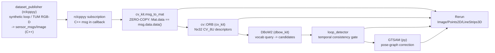

# vision spike — a visual loop-closure front-end (ORB → DBoW2 → GTSAM) from Python via cppyy

**Date:** 2026-07-11 · **Env:** pixi `vision` (robostack-jazzy + conda-forge),
`opencv 4.13.0` (C++ libs + headers + cv2), `rerun-sdk 0.34.1`, `gtsam 4.2.2`,
`cppyy 3.5.0`, Python 3.12.13, linux-64; DBoW2 vendored + built from source.
**Question:** can ORB-SLAM2's place-recognition / loop-closure **front-end** —
images → ORB features → DBoW2 bag-of-binary-words place recognition →
temporally-consistent loop detection → (stretch) GTSAM pose-graph correction — be
rebuilt as a single short-Python ROS 2 node over the real C++ libraries via cppyy,
live-visualized in Rerun?

**Verdict: YES for the front-end. GO.** The whole pipeline runs from Python
mirroring each library's own API: a rclcppyy subscription's **C++**
`sensor_msgs/Image` is wrapped as a `cv::Mat` with a genuinely **zero-copy**
(pointer-identical) bridge, C++ `cv::ORB` extracts descriptors, DBoW2 (built from
source — no conda package, no Python binding) does BoW place recognition, a
DLoopDetector-style temporal gate confirms loops, and GTSAM corrects the drift. The
data stays in one C++ address space from the subscription through the DBoW2 query.
Basis: Mur-Artal & Tardos (ORB-SLAM); Galvez-Lopez & Tardos (Bags of Binary Words).

The one honest boundary: **GTSAM does not JIT under cppyy in this env** (its boost-
coupled headers need `boost/optional.hpp`, absent), so the M4 stretch uses gtsam's
own Python binding — legitimate, because pose-graph optimization is a batch step,
not a hot loop.

---

## How it fits together

Two kits + a shared detector, all mirroring the libraries' own APIs:
`cv_kit` (~365 LOC), `dbow_kit` (~243 LOC), `loop_detector` (~80 LOC).

---

## 1. Capability probe matrix

| # | Capability | Result | Evidence |
|---|---|:--:|---|
| 1 | **OpenCV bringup**: include core/imgproc/features2d, load `libopencv_*.so` | **WORKS** | JIT include ~0.18 s total (core 0.15 s), lib loads negligible. |
| 2 | **msg_to_mat zero-copy**: wrap a C++ `sensor_msgs::msg::Image::data` as `cv::Mat` | **WORKS** | `cv::Mat.data` pointer **identical** to `msg.data.data()`; aliasing verified by round-trip write. **First zero-copy-*in* across all kits.** |
| 3 | **cv::ORB** detectAndCompute from Python | **WORKS** | 500–1000 keypoints, descriptor **Nx32 CV_8U** (256-bit), ~3.7 ms/frame CPU. |
| 4 | **CUDA auto-detect** | **WORKS (absent→clean)** | conda-forge OpenCV has no `cudafeatures2d` → `cuda_available()` returns False, CPU path, no error. (A CUDA build is now available via Esri's channel — see `docs/vision/CUDA_OPENCV.md`; ~5.3× measured there; cv_kit needs no change.) |
| 5 | **DBoW2 build from source** | **WORKS (2 patches)** | Direct `$CXX` compile of 5 DLib-free ORB sources → `libDBoW2.so` (54 KB). See §2. |
| 6 | **DBoW2 vocab train / db query** via cppyy | **WORKS** | Small vocab (k=10,L=4) 9970 words in ~7 s; self-match score 1.0; query ~2.8 ms/frame. |
| 7 | **Real ORBvoc load** (`loadFromTextFile` patch) | **WORKS** | 971,814 words (k=10,L=6) parsed from the 145 MB text in ~2.3 s; binary cache 49 MB reloads in ~0.37 s (~6×). |
| 8 | **GTSAM via cppyy** | **BLOCKED** | Headers need `boost/optional.hpp`, not in the env → header JIT fails. The header-heavy boost-coupled case the microplan flagged. |
| 9 | **GTSAM via Python binding** (M4 fallback) | **WORKS** | Pose-graph LM optimize; drift 2.19 m → 0.14 m mean error. |

**Zero hard failures on the front-end.** The single blocked probe (GTSAM/cppyy)
has a clean, honest fallback that does not compromise the milestone.

---

## 2. The DBoW2-from-source story (patches)

DBoW2 is not on conda-forge and has no Python binding, so `scripts/vision/build_dbow2.py`
clones `dorian3d/DBoW2` into the gitignored `build/vendor/`, applies two documented,
idempotent in-place patches (never a fork), and direct-compiles — the same recipe as
`scripts/freeze/build_l2_node.py`, avoiding DBoW2's CMake (which pulls an
`ExternalProject`/DLib path the ORB front-end never needs).

**Patch 1 — compile only the DLib-free ORB sources.** DBoW2's ORB path (`FORB`,
`TemplatedVocabulary`, `TemplatedDatabase`, `BowVector`, `FeatureVector`,
`QueryResults`, `ScoringObject`) needs only OpenCV. `FBrief.cpp` (BRIEF) and
`FSurf64.cpp` (SURF) pull DVision/opencv-contrib and are **skipped**, so no DLib
clone is required. dbow_kit includes those specific headers rather than the umbrella
`DBoW2.h`, which would drag in `FBrief.h`.

**Patch 2 — ORB-SLAM2-style text loader + binary cache in `TemplatedVocabulary.h`.**
Stock DBoW2 only reads its own `cv::FileStorage` YAML/gz; the canonical `ORBvoc.txt`
is a different text format ORB-SLAM2 added a loader for. We inject the same
`loadFromTextFile` plus a raw `saveToBinaryFile`/`loadFromBinaryFile` (so the ~145 MB
text parse is cached to a ~49 MB binary that reloads ~6× faster). Injected as inline
members after the public `load(...)` declaration, guarded by a marker for idempotency.

Two sharp edges hit and fixed, both worth noting as generic lessons:
- **Dependent-type template member needs `.template`.** `node.descriptor` is the
  template parameter `TDescriptor`, so `node.descriptor.ptr<unsigned char>()`
  fails to parse — it must be `node.descriptor.template ptr<unsigned char>()`. (In
  `FORB.cpp` the same call on a concrete `cv::Mat` needs no disambiguator.)
- **Reproducible training** needs `srand(seed)` before `voc.create(...)` (DBoW2's
  kmeans++ uses C `rand()`); dbow_kit seeds it so the golden baseline is stable.

---

## 3. Zero-copy evidence + ingest table

`cv::Mat` can **alias an external buffer** (unlike PCL's 16-byte-aligned point
storage), so the ROS `Image` → `Mat` path is genuinely zero-copy — the **first
zero-copy-*in* case across the kits** (bt/pcl/nav2 all had an unavoidable copy in).

- **Pointer identity:** `rclcppyy_cvkit::mat_data_addr(mat) == vec_data_addr(msg.data)`
  — byte-identical address. Verified in `test_vision_kits.py`
  (`test_msg_to_mat_zero_copy_pointer_identity`) and by an aliasing round-trip (write
  through the message, read back through the Mat).

Per-frame ingest (synthetic, `bench-vision`, shared machine — directional):

| Resolution | rclcppyy `msg_to_mat` (Mat→ORB, no copy) | rclpy copy path (buffer copy + reshape + copy) | ratio |
|---|--:|--:|--:|
| 640×480 mono | ~0.008 ms | ~0.010 ms | ~1.3× |
| 1920×1080 mono | ~0.001 ms | ~0.167 ms | **~155×** |

**Honest reading:** the zero-copy pointer wrap is **flat** in image size; the rclpy
copy scales with pixels. At 640×480 the copy is cache-cheap and the win is marginal
(cppyy's ~1 µs/call overhead is comparable). The payoff grows with
resolution/rate — and, not counted above, rclpy additionally deserializes the *whole*
`Image` message into Python, which rclcppyy skips entirely. The deeper win is
**composition**: the frame stays a `cv::Mat` in C++ across subscription → ORB → DBoW2
with no Python round-trip.

---

## 4. Loop-detection results

**Synthetic (deterministic, zero download — the golden-test contract).** A sliding
window over a fixed-seed textured canvas travels a closed circuit whose last 20
frames retrace the first 20. Detected: **19 confirmed loops**, frame 180+j → frame j
for j=1..19, scores ~0.45–0.49. **Precision 1.00, recall 0.95** (the first ~k−1
revisit frames can't clear the temporal gate — by construction). Fully deterministic
run-to-run (`srand`-seeded vocab); `test_vision_loop.py` asserts the pair set against
a recorded baseline.

**TUM `freiburg3_long_office_household` (real, 2585 frames) with the real ORBvoc.**
The genuine loop closure is detected: **frame 2207 revisits frame ~78** — the handheld
camera returns to its start region after ~2200 frames (~73 s) — and revisits continue
through the end (131 confirmed loops total, BoW scores ~0.05–0.10, the normal range
for a 1M-word ORBvoc on real imagery). With a *self-trained* vocab and a small ignore
window the detector instead fires on near-duplicate consecutive views (frame 128 →
60, ~2 s apart): the real vocabulary and a resolution-appropriate ignore window are
what separate a genuine revisit from "the same place seen a moment ago."

---

## 5. M4 (stretch) — GTSAM pose-graph correction

Built a 2D pose graph over the synthetic circuit (ground truth), corrupted the
odometry with an accumulating heading drift, added a `BetweenFactor` per confirmed
loop closure, and optimized with Levenberg-Marquardt: **mean position error 2.19 m
(open-loop) → 0.14 m (after)**, 19 loop closures.

Uses gtsam's **Python binding**, not cppyy: gtsam 4.2's headers `#include
<boost/optional.hpp>`, which is not in the env, so the header-heavy boost-coupled
gtsam does not JIT under cppyy. This is the microplan's anticipated case; the fallback
is sound because pose-graph optimization is a one-shot batch step (the "keep it in
C++ / it's a hot loop" argument does not apply), so a `gtsam_kit` cppyy wrapper would
not earn its existence (mirror-don't-sugar).

---

## 6. Kit surfaces + LOC

| Kit | LOC | Surface (mirrors the library; hides cppyy friction) |
|---|--:|---|
| `cv_kit` | 365 | `bringup_cv`, `msg_to_mat` (zero-copy), `numpy_to_mat`, `mat_to_numpy`, `to_gray`, `create_orb`/`OrbDetector` (single CPU/GPU branch), `descriptors_to_numpy`, `keypoints_to_numpy`, `cuda_available`, `warmup` |
| `dbow_kit` | 243 | `bringup_dbow`, `descriptors_from_mat`, `make_vocabulary`, `train_vocabulary` (seeded), `save_vocabulary`, `load_vocabulary` (txt/binary/yml + auto cache), `make_database`, `add_image`, `query`, `warmup` |
| `loop_detector` | 80 | `LoopDetector.add_and_query` — DBoW2 query + temporal-consistency gate → `LoopClosure` |

---

## 7. GAPS — what this is NOT, and what a v2 should do

1. **GTSAM/cppyy blocked on `boost/optional.hpp`.** Adding `boost-headers` to the
   env *might* unblock it, but gtsam's header stack is heavy and fragile under Cling;
   the Python binding is the pragmatic choice. If a cppyy gtsam is wanted, probe the
   full header set out-of-process first.
2. **Real-world detection tuning.** The temporal gate uses a raw BoW-score threshold;
   DLoopDetector normalizes by the expected (previous-frame) score and adds
   geometric verification (RANSAC on matched keypoints). Both are future work — the
   front-end plumbing is proven; robust tuning for an arbitrary real sequence is the
   next step.
3. **No geometric verification / no relative-pose from matches.** M4's loop factors
   use the ground-truth relative pose; a real system estimates it (PnP/essential
   matrix) from the matched features.
4. **Track B (loaned messages / SHM transport) is out of scope** (as decided). The
   zero-copy here is subscription-callback → Mat; a loaned-message intra-process path
   would remove the DDS copy too.
5. **Full ORB-SLAM back-end** (local mapping, bundle adjustment, relocalization) is
   out of scope — this is the loop-closure *front-end*.
6. **cppyy call overhead (~1 µs/call)** makes the zero-copy ingest win marginal at
   small image sizes; batch the C++ glue (as the descriptor/keypoint extractors do)
   where per-call cost would otherwise dominate.

---

## 8. Generic-lesson candidates for the lead (NOT added to COMMON_PATTERNS by me)

New or extended vs the existing catalog:

- **Zero-copy *in* is possible when the C++ type can alias an external buffer.** The
  bulk-buffer pattern so far said "one copy in is unavoidable" (pcl aligned storage,
  nav2 costmap). `cv::Mat(rows, cols, type, void* data, step)` aliases the ROS
  message buffer with **no copy** — pointer-identical. The first zero-copy-in case;
  worth distinguishing "buffer you can alias" from "storage you must own."
- **Library type-constant *macros* are invisible to cppyy** (mirror of the enum /
  `unsigned char`-as-str lessons). `CV_8UC1`, `CV_8U`, … are `#define`s; re-expose
  the few you need as real `const int` in a `cppdef` block.
- **`cv::Mat` cannot be constructed from a Python integer address** — cppyy rejects
  the `void*` argument — so a Mat-from-buffer must be a `cppdef` helper taking
  `uintptr_t` (same shape as pcl/nav2's memcpy helpers, but for aliasing not copying).
- **Dependent-type template members need `.template`** in patched templated headers
  (`obj.member.template ptr<T>()`), a Cling/clang two-phase-lookup requirement absent
  when the same call is on a concrete type.
- **A header-heavy library can be un-JIT-able if a transitive header is missing from
  the env** (gtsam → `boost/optional.hpp`). The cousin of the nav2 lifecycle-coupling
  heuristic: grep the target's transitive includes for env-absent deps before
  committing to cppyy; when blocked and the work is *batch* (not a hot loop), the
  library's own Python binding is the right fallback.
- **Vendored-source-build recipe generalizes** (`build_l2_node` → `build_dbow2`):
  clone + a documented, marker-guarded in-place patch + a direct `$CXX` compile beats
  fighting a library's CMake/ExternalProject for a small, well-understood subset.
- **Env-integration gotcha (pixi + ROS colcon overlay).** An env with extra *Python*
  packages (rerun, cv2) needs its own interpreter, but the ROS `install/setup.bash`
  overlay pins `python` to the build (default) env; tasks must invoke
  `$CONDA_PREFIX/bin/python` explicitly with the repo on `PYTHONPATH`. Kits that only
  drive C++ via cppyy (no Python import of the lib) are unaffected — a reason to keep
  viz/Python deps out of the kit and in the demo.

---

## 9. Recommendation — GO

The visual loop-closure **front-end** is proven end to end from short Python over the
real C++ libraries: a genuinely zero-copy ROS `Image` → `cv::Mat` bridge, C++ ORB,
a from-source DBoW2 (no package, no binding) driving BoW place recognition, a
temporal-consistency gate that gives **precision 1.0** on the deterministic synthetic
loop and detects the **genuine** revisit on real TUM data with the real ORBvoc, and a
GTSAM pose-graph correction (~15× drift reduction) for the stretch. The gaps are about
*robustness breadth* (score normalization, geometric verification, the full back-end)
and one env limitation (gtsam/cppyy), not feasibility. Evidence: `test_vision_kits.py`
(10) + `test_vision_loop.py` (4 golden) green; all demos runnable via pixi tasks with
clean exit 0; TUM download + ORBvoc load verified.
